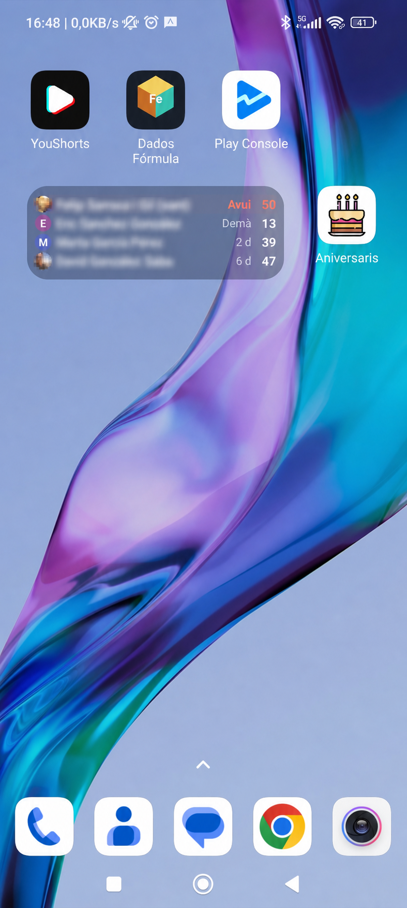
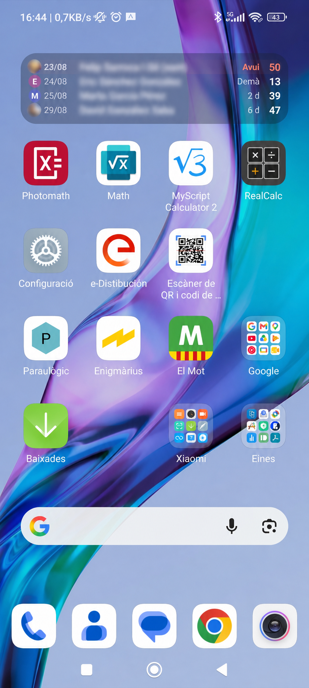
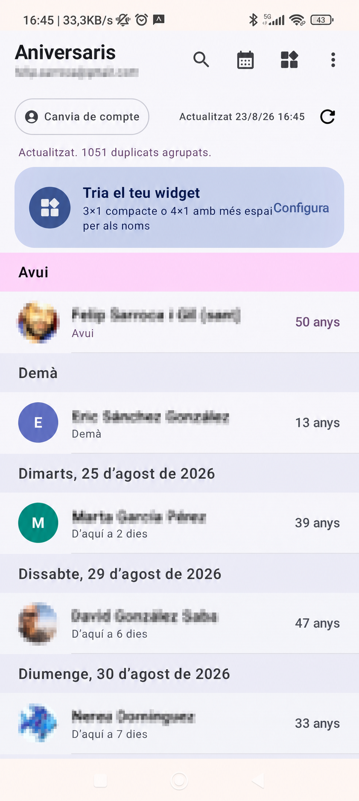
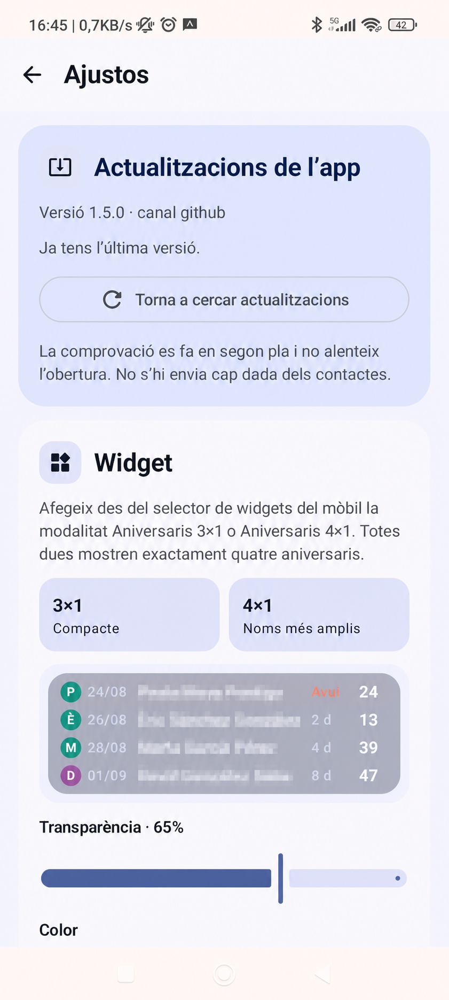
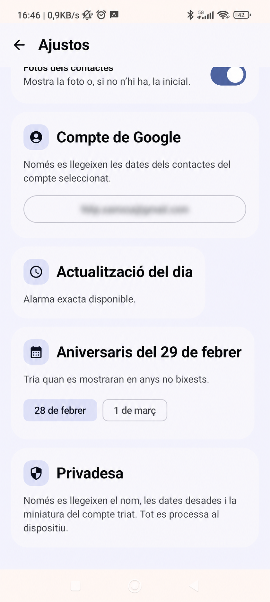
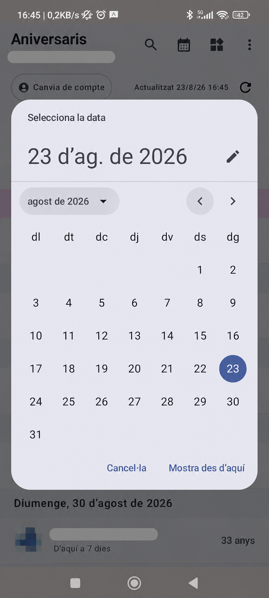
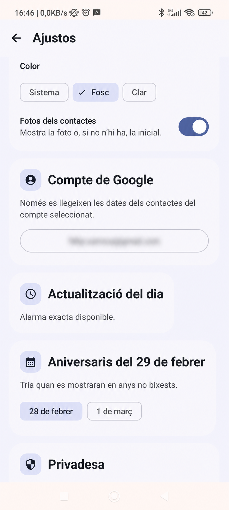

<div align="center">
  
  <h1>Aniversaris</h1>
  <p><strong>Els aniversaris i les dates especials dels teus contactes, sempre a mà.</strong></p>
  <p>Aplicació Android nativa, privada i sense servidor, amb widgets 3×1 i 4×1.</p>
  <p>
    <a href="https://ja.cat/app-aniversaris">Descarrega l’APK</a> ·
    <a href="docs/GOOGLE_PLAY.md">Publicació a Google Play</a> ·
    <a href="PRIVACITAT.md">Privacitat</a>
  </p>
</div>

## Què és?

Aniversaris consulta les dates especials dels contactes sincronitzats al dispositiu Android i les presenta de manera clara, ordenada i útil. Pots seleccionar quin compte de Google vols consultar, veure les dates dins de l’app i afegir un widget a la pantalla d’inici.

L’app està pensada per funcionar de forma local: no necessita un compte propi, no conté anuncis i no envia les dades dels contactes a cap servidor.

## Funcions destacades

- Aniversaris i altres dates etiquetades, com **sant** o **defunció**.
- Càlcul dels anys quan el contacte té informat l’any d’origen.
- Diverses dates del mateix contacte, cadascuna al dia que correspon.
- Selecció del compte de Google dels contactes.
- Fotos dels contactes o inicial alternativa.
- Widget **3×1 compacte** i widget **4×1 amb més espai per als noms**.
- Quatre dates per widget, amb data, nom, proximitat i anys.
- Mode clar, mode fosc i transparència configurable.
- Fila d’avui ressaltada amb color.
- Calendari per consultar una data concreta i cerca de contactes.
- Actualització diària automàtica.
- Actualitzacions diferenciades segons el canal: GitHub o Google Play.

## Galeria

Les captures següents provenen de la versió actual i han estat anonimitzades abans d’incorporar-les al repositori. Els noms, correus i fotografies personals estan ocults.

### Widget 4×1

<p align="center">
  
  
</p>

### Pantalla principal i configuració

<p align="center">
  
  
  
</p>

### Calendari i privacitat

<p align="center">
  
  
</p>

## Instal·lació de prova

La versió de GitHub és una APK instal·lable directament en un mòbil Android:

1. Obre [ja.cat/app-aniversaris](https://ja.cat/app-aniversaris) o la [release més recent](https://github.com/felipsarroca/util-apps/releases).
2. Descarrega l’APK.
3. Si Android ho demana, autoritza temporalment el navegador o el gestor de fitxers a instal·lar aplicacions desconegudes.
4. Instal·la l’APK sobre la versió anterior per conservar les dades i preferències locals.

La variant GitHub utilitza un canal d’actualització propi. La variant de Google Play utilitzarà Play In-App Updates i no descarregarà APK externes.

## Posada en marxa del projecte

Requisits locals:

- Android Studio compatible amb AGP 9.3.1.
- JDK 17.
- Android SDK 37 i Build Tools corresponents.
- Gradle Wrapper inclòs al projecte.

Des de `I:\Mi unidad\Github\util-apps\Aniversaris`:

```powershell
$env:JAVA_HOME = 'C:\Program Files\Eclipse Adoptium\jdk-17.0.20.8-hotspot'
$env:GRADLE_USER_HOME = 'C:\Users\Public\GradleCache'
$env:Path = "$env:JAVA_HOME\bin;$env:Path"
.\gradlew.bat testGithubDebugUnitTest testPlayDebugUnitTest lintGithubDebug lintPlayDebug assembleGithubDebug assemblePlayDebug --no-daemon --max-workers=2
```

Per preparar la versió de Google Play caldrà configurar primer la signatura de producció i després executar `bundlePlayRelease`. No es desa cap clau privada al repositori.

## Privacitat i permisos

L’app demana `READ_CONTACTS` per llegir les dates del compte seleccionat. També declara els permisos necessaris per actualitzar el widget després de reinicis, canvis d’hora i actualitzacions diàries.

No llegeix telèfons, correus, adreces, notes ni historial de comunicacions. El tractament és local i la memòria cau es pot reconstruir.

Consulta la [política de privacitat](PRIVACITAT.md) i la [documentació d’arquitectura](ARQUITECTURA.md).

## Publicació a Google Play

La guia completa de continuïtat és a [docs/GOOGLE_PLAY.md](docs/GOOGLE_PLAY.md). Inclou:

- configuració de Play App Signing;
- preparació de l’Android App Bundle (`.aab`);
- formularis de seguretat de dades i classificació;
- textos de la fitxa;
- captures preparades per a la fitxa;
- prova interna, prova tancada i accés a producció.

També pots consultar la [fitxa preparada](docs/play-store/fitxa.md) i el [checklist de publicació](docs/play-store/checklist.md).

## Estat del projecte

- Versió GitHub actual: **1.5.0** (`versionCode 6`).
- Identificador Play previst: `cat.felipsarroca.aniversaris`.
- Primer canal: GitHub Releases, per a proves personals.
- Canal futur: Google Play amb la mateixa seqüència de versions.

## Autoria i llicència

Aplicació creada per **Felip Sarroca**.

El projecte i els materials es publiquen sota [CC BY-NC-SA 4.0](https://creativecommons.org/licenses/by-nc-sa/4.0/deed.ca), excepte les dependències de tercers, que conserven les seves pròpies llicències.
