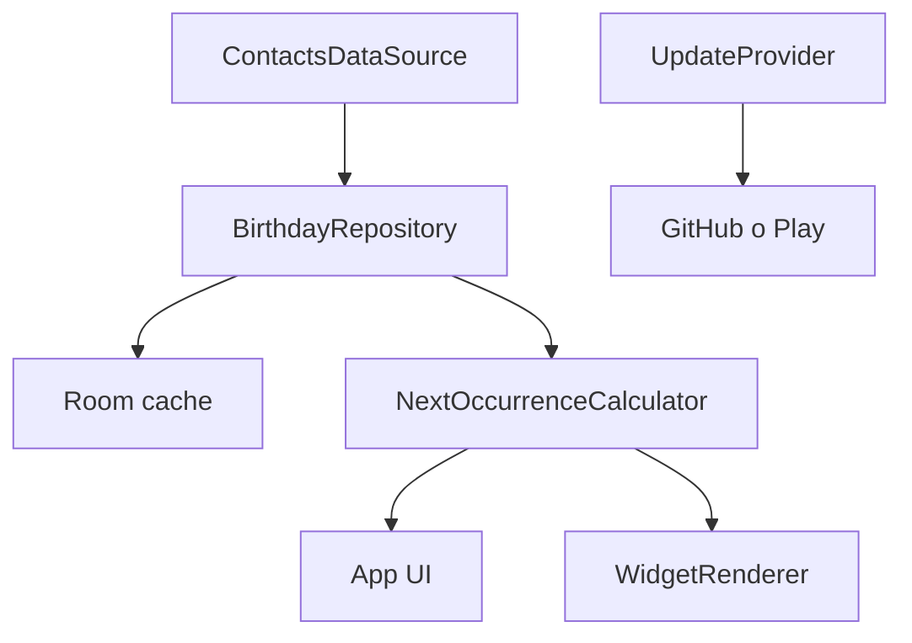

# Especificació funcional i tècnica per al desenvolupament de l’app Aniversaris

**Versió del document:** 1.0  
**Data:** 22 d’agost de 2026  
**Plataforma:** Android natiu  
**Destinatari:** programador/a Android  
**Document relacionat:** `estudi_app_aniversaris_android.md`

## 1. Propòsit i autoritat del document

Aquest document defineix la primera versió publicable d’una app Android que llegeix els aniversaris dels contactes sincronitzats al dispositiu, els ordena a partir del dia actual i els mostra tant dins de l’app com en un widget 4×1 o 4×2. La primera distribució serà una APK signada a GitHub Releases; l’arquitectura ha de permetre publicar més endavant la mateixa app a Google Play sense perdre dades ni obligar a desinstal·lar-la.

Les decisions marcades com a **obligatòries** no s’han de canviar sense consultar el propietari. Les propostes de noms, colors o identificadors marcades com a candidates es poden ajustar abans de la primera release signada.

## 2. Objectiu de producte

L’usuari ha de poder mirar la pantalla d’inici del mòbil i saber:

- qui fa anys avui;
- quants anys compleix, si el contacte té any de naixement;
- quins són els aniversaris immediatament següents;
- que la informació s’ha actualitzat en començar el dia.

L’app ha de ser instal·lable, autoritzable i pràcticament oblidada. No és una agenda alternativa ni una xarxa social. Google Contacts, sincronitzat mitjançant Android, continua sent la font original.

## 3. Abast de la versió 1

### 3.1 Inclòs

- App Android nativa en català.
- Lectura de noms i aniversaris del Contacts Provider d’Android.
- Selecció d’un compte de contactes; preselecció de `felip.sarroca@gmail.com` quan existeixi.
- Llista circular dels pròxims dotze mesos, ordenada des d’avui.
- Agrupació per Avui, Demà i data.
- Càlcul de l’edat que es compleix.
- Dates amb any i sense any.
- Cerca per nom i salt a una data.
- Deduplicació robusta.
- Memòria cau local mínima.
- Widget redimensionable 4×1 / 4×2, semitransparent.
- Actualització en començar el dia, en obrir l’app, després d’un canvi de contacte detectat i manualment.
- Variant de distribució GitHub amb comprovació de versions.
- Variant de distribució Google Play preparada per usar Play In-App Updates.
- Pantalla mínima d’ajustos.
- Mode clar/fosc i accessibilitat bàsica.

### 3.2 Fora d’abast

- Compte propi, servidor o núvol de l’app.
- People API, OAuth o inici de sessió Google dins de l’app.
- Edició de contactes.
- Escriptura al calendari.
- Missatgeria automàtica, regals, zodíac, efemèrides o xarxes socials.
- Analítica, anuncis o seguiment de l’usuari.
- Actualitzacions silencioses.
- iOS.

## 4. Decisions irreversibles abans de la primera APK

Abans de generar la primera release instal·lable s’han de confirmar i documentar aquests valors:

| Element | Proposta | Regla |
|---|---|---|
| Nom visible | `Aniversaris` | Es pot canviar sense afectar actualitzacions |
| `applicationId` | `cat.felipsarroca.aniversaris` | **No es pot canviar després de publicar** |
| Clau de signatura | Keystore definitiu del propietari | **La mateixa durant tota la vida de l’app** |
| Versió inicial | `versionName 1.0.0`, `versionCode 1` | El `versionCode` sempre ha de créixer globalment |
| Repositori | `{GITHUB_OWNER}/{GITHUB_REPO}` | Substituir abans de compilar `githubRelease` |
| Compte preferit | `felip.sarroca@gmail.com` | Només preselecció; no bloquejar altres comptes |

La clau privada, el fitxer `.jks`, els àlies i les contrasenyes no s’han de confirmar al repositori. Cal conservar-ne dues còpies xifrades separades i guardar la contrasenya en un gestor de contrasenyes.

## 5. Arquitectura proposada

### 5.1 Tecnologies

- Kotlin i corrutines.
- Android Studio i Gradle Kotlin DSL.
- Jetpack Compose + Material 3 per a pantalles.
- Jetpack Glance per al widget.
- Room per a memòria cau.
- DataStore Preferences per a ajustos.
- AlarmManager per al canvi de dia.
- WorkManager per a tasques de seguretat i comprovació setmanal d’actualitzacions.
- Play In-App Updates només a la variant `play`.
- Client HTTP lleuger per a l’API pública de GitHub només a la variant `github`.

### 5.2 Separació de responsabilitats



Interfícies mínimes recomanades:

```kotlin
interface ContactsDataSource {
    suspend fun listAccounts(): List<ContactAccount>
    suspend fun readBirthdays(account: ContactAccount): List<RawBirthday>
}

interface BirthdayRepository {
    fun observeUpcoming(from: LocalDate): Flow<List<UpcomingBirthday>>
    suspend fun refresh(reason: RefreshReason): RefreshResult
    suspend fun clearSensitiveCache()
}

interface UpdateProvider {
    suspend fun check(): UpdateCheckResult
    suspend fun startUpdate(update: AvailableUpdate): UpdateStartResult
}

interface ClockProvider {
    fun now(): ZonedDateTime
}
```

`ClockProvider` és obligatori per provar canvis d’any, mitjanit, zona horària i 29 de febrer sense dependre del rellotge real.

### 5.3 Mòduls o paquets

- `data.contacts`: consultes al Contacts Provider.
- `data.local`: Room, DAO i migracions.
- `domain.birthdays`: normalització, deduplicació, pròxima ocurrència i edat.
- `feature.list`: pantalla principal, cerca i selector de data.
- `feature.settings`: compte, widget, canvi de dia i actualitzacions.
- `widget`: Glance, configuració i receptors.
- `updates.api`: models i contracte compartit.
- `updates.github`: només variant GitHub.
- `updates.play`: només variant Play.
- `scheduling`: alarmes, WorkManager i reprogramació.

## 6. Font de dades i permisos

### 6.1 Estratègia obligatòria

No s’ha d’accedir directament a Gmail ni a Google People API. L’app consultarà l’agenda local d’Android, que ja conté els contactes sincronitzats del compte Google.

Flux de lectura recomanat:

1. Consultar `RawContacts` per localitzar els identificadors associats al compte seleccionat.
2. Per a un compte Google, verificar `ACCOUNT_TYPE = com.google` i el nom del compte.
3. Consultar les files `Data` associades a aquests raw contacts.
4. Acceptar únicament `CommonDataKinds.Event.CONTENT_ITEM_TYPE` amb `TYPE_BIRTHDAY`.
5. Recuperar nom visible, identificadors, `LOOKUP_KEY`, data i URI de miniatura opcional.
6. Normalitzar i deduplicar fora del fil principal.
7. Escriure una transacció completa a Room.

No llegir ni desar telèfons, correus, adreces, notes o historial de comunicacions.

### 6.2 Permisos per variant

| Permís | GitHub | Play | Motiu |
|---|:---:|:---:|---|
| `READ_CONTACTS` | Sí | Sí | Funció principal |
| `SCHEDULE_EXACT_ALARM` | Sí | Sí | Canvi del widget en començar el dia |
| `RECEIVE_BOOT_COMPLETED` | Sí | Sí | Reprogramar alarmes |
| `INTERNET` | Sí | Sí | Comprovar/obtenir actualitzacions; Play Core també necessita xarxa |
| `ACCESS_NETWORK_STATE` | Sí | Sí | Evitar intents sense connexió |
| `POST_NOTIFICATIONS` | Opcional | Opcional | Només si s’implementa avís diari voluntari |
| `REQUEST_INSTALL_PACKAGES` | No inicialment | **Mai** | A GitHub s’obrirà la descàrrega al navegador; Play prohibeix l’autoactualització externa |

La primera pantalla prèvia a `READ_CONTACTS` ha de dir, en llenguatge planer:

> Per mostrar els aniversaris, l’app necessita llegir el nom i la data d’aniversari dels contactes del compte que triïs. Les dades es processen al telèfon i no s’envien fora.

Si el permís es denega, mostrar `Dona accés als contactes` i un botó per tornar-lo a sol·licitar o obrir els ajustos. Si es revoca després, esborrar la memòria cau sensible i actualitzar el widget a l’estat sense permís.

## 7. Model de dades local

### 7.1 Entitat principal

```text
BirthdayEntity
- id: String                    // clau interna estable
- lookupKey: String?
- contactId: Long?
- rawContactIds: Set<Long>      // serialitzat o taula relacionada
- displayName: String
- normalizedName: String
- day: Int
- month: Int
- birthYear: Int?
- photoThumbnailUri: String?
- accountName: String
- accountType: String
- sourceFingerprint: String
- updatedAtEpochMillis: Long
```

No desar `nextDate`, `daysRemaining` ni `ageTurning` com a veritat persistent: són derivats del dia actual i s’han de recalcular. Es poden materialitzar temporalment en models de presentació.

### 7.2 Preferències DataStore

- `selected_account_name`
- `selected_account_type`
- `leap_day_rule`: valor inicial `FEB_28`
- `widget_theme`: `SYSTEM`, `DARK`, `LIGHT`
- `widget_alpha`: valor inicial 0,72; límit recomanat 0,55–0,90
- `widget_show_avatars`: inicialment fals en 4×1 i cert en 4×2 si hi caben
- `update_check_frequency`: `NEVER`, `WEEKLY`, `ON_APP_OPEN`; inicialment `WEEKLY`
- `last_update_check_at`
- `last_contacts_refresh_at`
- `onboarding_completed`

La base de dades i aquestes preferències no s’han d’incloure en còpies al núvol si contenen identificadors de contactes. La memòria cau és reconstruïble.

## 8. Normalització i deduplicació

### 8.1 Normalització de dates

`START_DATE` pot arribar com a text amb o sense any. El lector ha de suportar, com a mínim:

- `yyyy-MM-dd`
- `--MM-dd`
- formats retornats pels proveïdors Google habituals que s’observin a les proves reals

No interpretar dates ambigües silenciosament. Els registres no parsejables s’han d’excloure del widget i comptabilitzar a `RefreshResult.invalidRows` per poder diagnosticar-los.

### 8.2 Normalització de noms

Per comparar, crear una forma amb:

- `trim`;
- espais consecutius reduïts a un;
- minúscules segons `Locale.ROOT`;
- accents eliminats només per a la clau comparativa.

Conservar sempre el nom original per mostrar-lo.

### 8.3 Ordre de deduplicació

1. Mateixa fila d’origen: una sola entrada.
2. Mateix `CONTACT_ID` o `LOOKUP_KEY` i mateixa data normalitzada: agrupar.
3. Mateix compte, mateix nom normalitzat i mateixa data completa: agrupar, conservant tots els `rawContactIds`.
4. Si falta l’any, agrupar per mateix compte + nom normalitzat + dia + mes només si el nom visible coincideix després de normalitzar espais, majúscules i accents.
5. Si els anys entren en conflicte, no inventar-ne un: marcar el grup com a conflictiu i no mostrar edat fins que es resolgui.

La clau interna ha de derivar preferentment dels identificadors d’origen ordenats i la data, no només del nom. Un canvi de nom no ha de generar una segona persona.

## 9. Pròxima ocurrència i edat

Per a cada contacte:

```text
candidate = aniversari(day, month, currentYear)
if candidate < today:
    candidate = aniversari(day, month, currentYear + 1)
daysRemaining = DAYS.between(today, candidate)
ageTurning = birthYear != null ? candidate.year - birthYear : null
```

Regles:

- `candidate == today` produeix `Avui` i zero dies.
- El 31 de desembre ha d’ordenar correctament l’1 de gener.
- Sense any no es mostra cap número d’edat ni `0 anys`.
- Amb any impossible o futur, la dada es marca invàlida.
- El 29 de febrer, en any no bixest, es tracta inicialment com el 28 de febrer; l’ajust s’ha de poder canviar a 1 de març.
- Tots els càlculs usen `ZoneId.systemDefault()` i `LocalDate`; no usar diferències de mil·lisegons per comptar dies.

## 10. Requisits de la interfície

### 10.1 Primera execució

1. Benvinguda d’una sola pantalla.
2. Explicació de privadesa i botó `Continua`.
3. Sol·licitud de `READ_CONTACTS`.
4. Llista dels comptes de contactes disponibles; preseleccionar l’adreça indicada si existeix.
5. Primera sincronització amb progrés discret.
6. Resum de preparació: contactes, alarma exacta i instrucció per afegir el widget.

No bloquejar l’ús si es denega l’alarma exacta; informar que el canvi de dia pot arribar uns minuts tard.

### 10.2 Pantalla principal

Capçalera:

- títol `Aniversaris`;
- acció de cerca;
- acció de calendari/data;
- menú d’ajustos;
- últim refresc en text secundari.

Llista:

- seccions `Avui`, `Demà` i dates posteriors;
- ordre ascendent per pròxima ocurrència i, dins del dia, per nom;
- fila amb avatar/monograma petit, nom, proximitat i edat;
- exemples: `Paula Moya Postigo — avui · 24 anys`, `Eric Sánchez González — d’aquí a 2 dies · 13 anys`;
- tocar una fila pot obrir la fitxa del contacte mitjançant un `Intent` del sistema;
- pull-to-refresh força lectura i actualitza tots els widgets.

El selector de data desplaça la llista fins a la primera data igual o posterior. La cerca ignora majúscules i accents.

### 10.3 Estats obligatoris

- Sense permís.
- Sense compte compatible.
- Primera càrrega.
- Compte sense aniversaris.
- Error de lectura amb última memòria cau vàlida.
- Error sense memòria cau.
- Dades actualitzades.

Un error transitori no ha d’esborrar l’última memòria cau vàlida.

### 10.4 Ajustos mínims

- Compte de contactes.
- Regla del 29 de febrer.
- Aparença del widget: tema, transparència i avatars.
- Actualització del dia: estat de l’alarma exacta i accés als ajustos del sistema.
- Actualitzacions de l’app: versió actual, canal, freqüència i `Comprova ara`.
- Privadesa: resum de les dades llegides.
- Quant a: versió, llicències i enllaç a GitHub.

No afegir paràmetres que no resolguin una necessitat real.

## 11. Especificació del widget

### 11.1 Comportament comú

- Un únic widget redimensionable.
- Amplada objectiu de quatre columnes.
- Fons fosc semitransparent inicial al 72%, cantonades arrodonides i contrast accessible.
- Avui sempre té prioritat; després, dies futurs.
- Tocar el fons obre l’app a Avui.
- Tocar una fila obre l’app centrada en aquella data.
- Conservar les últimes dades vàlides si falla un refresc.

### 11.2 4×1

- Fins a quatre files compactes.
- Nom 52–58%, proximitat 24–28%, edat 16–20%.
- Nom en una línia amb el·lipsi final.
- Avui en seminegreta i accent discret.
- Si avui té més de quatre persones: tres noms i `+N més avui`.
- Si en té menys, completar amb els pròxims aniversaris.

### 11.3 4×2

- Sis a vuit files segons densitat i escala de font.
- Capçalera opcional `Avui i pròxims`.
- Avatar de 28–32 dp només si no redueix la llegibilitat.
- Mateixa prioritat d’avui i fila `+N més` quan calgui.

### 11.4 Contingut especial

- Sense aniversaris en trenta dies: mostrar el següent disponible.
- Sense permís: `Dona accés als contactes`.
- Primera càrrega: `Obre Aniversaris per preparar el widget`.
- Error amb memòria cau: mostrar dades i un indicador petit, no una superfície buida.

## 12. Canvi de dia i sincronització

### 12.1 Programació

- Programar una alarma a les `00:00:05` locals.
- Si `canScheduleExactAlarms()` és cert, usar alarma exacta.
- Si no, usar una alternativa aproximada i WorkManager com a seguretat.
- Després de cada execució, programar el dia següent.
- Reprogramar amb `BOOT_COMPLETED`, `TIME_CHANGED` i `TIMEZONE_CHANGED`.
- Refrescar en obrir l’app, després de canviar el compte i després de concedir permisos.

La tasca de mitjanit ha de recalcular primer des de la memòria cau, actualitzar el widget immediatament i després provar de rellegir contactes. Així el canvi de `Demà` a `Avui` no depèn d’una consulta que pugui fallar.

### 12.2 Xiaomi/HyperOS

Provar en el dispositiu real. Mostrar una guia curta, no intrusiva, per revisar:

- `Alarmes i recordatoris`;
- política de bateria sense restriccions si el fabricant bloqueja alarmes;
- autoinici només si les proves demostren que és necessari;
- widget afegit.

No mantenir un servei permanent.

## 13. Distribució, actualitzacions i extensibilitat

### 13.1 Variants de compilació

Configurar dos `productFlavors` sota una dimensió `distribution`:

```kotlin
android {
    flavorDimensions += "distribution"
    productFlavors {
        create("github") {
            dimension = "distribution"
            buildConfigField("String", "UPDATE_SOURCE", "\"github\"")
        }
        create("play") {
            dimension = "distribution"
            buildConfigField("String", "UPDATE_SOURCE", "\"play\"")
        }
    }
}
```

Ambdues variants han de tenir exactament el mateix `applicationId`, esquema Room i comportament funcional. Les dependències, recursos i manifests específics s’han de separar per source set.

### 13.2 Actualització de GitHub

Endpoint inicial:

```text
GET https://api.github.com/repos/{GITHUB_OWNER}/{GITHUB_REPO}/releases/latest
Accept: application/vnd.github+json
X-GitHub-Api-Version: 2022-11-28
```

Un repositori públic permet la consulta sense credencials. No posar cap token personal dins de l’APK.

Cada release estable ha d’incloure:

- tag `vX.Y.Z`;
- APK `aniversaris-vX.Y.Z.apk`;
- checksum `aniversaris-vX.Y.Z.apk.sha256`;
- notes de versió;
- un `versionCode` llegible de manera inequívoca. Recomanació: incloure `versionCode: N` al cos de la release i validar-lo estrictament, o publicar un petit `update.json` signat com a asset.

Estats del comprovador:

```text
Idle → Checking → UpToDate
                → Available → UserAccepted → Browser/SystemDownload
                → Offline
                → Error
```

Regles:

- ignorar drafts i prereleases en el canal estable;
- comparar `versionCode`, no cadenes de versió;
- usar ETag/`If-None-Match` per reduir trànsit;
- no mostrar el mateix avís més d’una vegada al dia;
- no descarregar res sense tocar `Actualitza`;
- conservar l’app actual si hi ha qualsevol error;
- no enviar noms, identificadors ni dates de contactes a GitHub.

La versió 1 obrirà l’asset o la pàgina de la release al navegador. Android gestionarà la descàrrega i demanarà confirmació d’instal·lació. Si es desenvolupa posteriorment un instal·lador intern per a la variant GitHub, haurà de verificar SHA-256, paquet, `versionCode` i empremta del certificat abans d’invocar l’instal·lador del sistema; mai serà silenciós.

### 13.3 Actualització de Google Play

`PlayUpdateProvider` usarà la llibreria oficial Play In-App Updates. Flux preferit:

1. Consultar disponibilitat en obrir Ajustos o amb una comprovació no intrusiva.
2. Si hi ha update permesa, oferir modalitat flexible.
3. Descarregar mitjançant Google Play.
4. Mostrar `Reinicia per acabar d’actualitzar` quan estigui preparada.
5. Completar només després de l’acció de l’usuari.

Reservar el flux immediat per a una correcció crítica futura. La variant Play:

- no inclou `REQUEST_INSTALL_PACKAGES`;
- no obre APK de GitHub com a actualització;
- no conté codi d’instal·lació externa;
- pot mantenir l’enllaç a GitHub només com a codi font o informació.

### 13.4 Migració GitHub → Google Play

Perquè Play pugui substituir una APK instal·lada des de GitHub cal:

- mateix `applicationId`;
- mateix certificat de signatura;
- `versionCode` de Play superior;
- paquet compatible;
- compte Google del dispositiu amb dret a obtenir l’app des de Play.

Quan es configuri Play App Signing, s’ha de seleccionar l’ús de la **clau de signatura existent**. Després, crear una clau de pujada diferent. Abans d’anunciar la migració, fer una prova completa amb un compte de prova: instal·lar una APK de GitHub amb dades/widget, adquirir o instal·lar la versió de Play i confirmar que actualitza sense desinstal·lar ni perdre configuració.

No publicar una versió a cap canal amb `versionCode` inferior al màxim ja publicat. Mantenir un registre de versions al repositori.

### 13.5 GitHub Actions i secrets

Flux recomanat:

1. Pull request: compilació, lint i tests, sense signar release.
2. Tag `vX.Y.Z`: build reproduïble i artefacte de prova.
3. Aprovació manual del propietari.
4. Signatura release en un entorn segur.
5. Generació de SHA-256.
6. Publicació de GitHub Release.

Opció conservadora: signar localment i pujar només l’APK final. Si s’automatitza, el keystore xifrat i les contrasenyes han d’estar en secrets protegits, amb accés mínim i aprovació d’entorn. Mai imprimir-los als logs ni exposar-los a builds de pull requests externes.

## 14. Preparació per a Google Play

La publicació és viable, però s’ha de preparar des de l’inici.

### 14.1 Artefactes i compte

- Compte Play Console amb quota única vigent.
- Verificació d’identitat i, quan correspongui, de dispositiu.
- AAB signat per pujada.
- Icona d’alta resolució, gràfic promocional i captures reals.
- Nom curt, descripció curta i descripció completa.
- Correu de suport i URL de política de privadesa.
- Formulari Data Safety coherent amb el codi real.
- Classificació de contingut i països de distribució.
- Prova tancada exigida al compte. Per a molts comptes personals creats després del 13 de novembre de 2023, la regla actual és un mínim de dotze verificadors durant catorze dies seguits abans de demanar accés a producció.

### 14.2 Política de privadesa

Ha de ser una pàgina HTML pública, per exemple a GitHub Pages, no només un PDF. Ha d’explicar:

- quines dades es llegeixen: nom i aniversari del compte triat;
- finalitat: llista i widget;
- processament local;
- absència de venda, anuncis i analítica;
- ús d’Internet exclusivament per actualitzacions;
- esborrament de la memòria cau en revocar permisos o esborrar dades;
- forma de contacte del responsable.

### 14.3 Permís de contactes a Play

`READ_CONTACTS` és l’element amb més risc de revisió. Per a apps orientades a Android 17/API 37 o superior, Play demana declarar l’ús i justificar per què Contact Picker no és suficient. Justificació funcional prevista:

> La funció principal és detectar automàticament tots els aniversaris emmagatzemats al compte de contactes seleccionat i mantenir actualitzat un widget diari. La selecció manual d’un subconjunt de contactes impediria detectar altes o canvis i no permetria oferir una llista completa i automàtica.

La mateixa finalitat ha d’aparèixer a la fitxa, onboarding i política de privadesa. No demanar el permís abans que l’usuari vegi aquesta explicació. Mantenir `ContactsDataSource` desacoblat per poder oferir, si fos necessari, un mode alternatiu basat en selecció manual.

## 15. Seguretat i privadesa tècnica

- Tot el processament de contactes és local.
- Cap dada de contacte apareix en logs de producció, informes d’error o peticions de xarxa.
- Desactivar o redactar logs de consulta en `release`.
- No incloure analítica ni crash reporting que capturi dades personals sense una decisió posterior explícita.
- Usar HTTPS per GitHub i Play.
- No confiar només en el nom de l’asset; verificar metadades abans d’una instal·lació interna futura.
- Exportació de components Android mínima i explícita.
- `PendingIntent` immutable quan sigui possible.
- Validar intents i URIs del widget.
- Room amb migracions provades; no activar `fallbackToDestructiveMigration` en producció.

## 16. Rendiment i qualitat

- Cap consulta de contactes al fil principal.
- Primera càrrega amb indicador, sense bloqueig de la interfície.
- Lectura incremental o debounce si s’observen molts canvis seguits.
- Actualització de Room en una transacció.
- Widget dibuixat des de models ja preparats; no fer una consulta completa de contactes durant cada render.
- Temps objectiu per mostrar memòria cau en obrir: menys de 300 ms en el dispositiu de prova.
- Temps objectiu de refresc complet: menys de 3 s amb 5.000 contactes, subjecte al dispositiu.
- Consum de xarxa del comprovador: una petició setmanal, amb caché HTTP.
- Minimitzar wakeups: una alarma de dia i treballs únics, no polling freqüent.

## 17. Pla de proves

### 17.1 Tests unitaris

- Formats de data amb i sense any.
- Data passada, avui i futura.
- 31 de desembre → 1 de gener.
- Any bixest i regla del 29 de febrer.
- Càlcul de l’edat que es compleix.
- Any futur o invàlid.
- Normalització d’accents i espais.
- Duplicats amb mateix `LOOKUP_KEY`.
- Canvi de nom sense duplicació.
- Conflicte d’anys.
- Ordenació múltiple en un mateix dia.
- Comparació de `versionCode`.
- Releases draft, prerelease, igual, inferior i superior.

### 17.2 Tests d’integració/instrumentació

- Permís concedit, denegat i revocat.
- Canvi de compte.
- Migracions Room.
- Render 4×1 i 4×2.
- Escala de font normal i gran.
- Mode clar/fosc i fons clar/fosc.
- Alarmes després de reinici i canvi de zona.
- Sense xarxa durant la comprovació de versions.
- Resposta GitHub malformada o asset absent.
- Play update disponible/no disponible en pista interna.
- Manifest final de cada variant.

### 17.3 Prova manual de releases

Matriu mínima:

| Cas | Procediment | Resultat esperat |
|---|---|---|
| GitHub 1 → GitHub 2 | Instal·lar v1, configurar widget, actualitzar amb v2 | Dades i widget es conserven |
| GitHub → Play | Instal·lar APK GitHub i després versió Play superior signada igual | Actualització in situ |
| Signatura incorrecta | Intentar instal·lar paquet igual signat diferent | Android el rebutja |
| Versió inferior | Intentar downgrade normal | No substitueix la versió actual |
| Mitjanit | Deixar widget abans de les 00.00 | Avui/Demà canvien sense obrir l’app |
| Procés eliminat | Forçar aturada de memòria, no desactivar app | El widget conserva dades i es recupera |
| Xiaomi | Repetir reinici, bateria i mitjanit a HyperOS | Funcionament documentat i fiable |

## 18. Criteris d’acceptació de la versió 1

1. Llegeix exclusivament els aniversaris del compte seleccionat.
2. No envia dades de contactes per xarxa.
3. Una persona repetida tècnicament apareix una sola vegada.
4. Un canvi de nom no crea duplicat.
5. La llista cobreix els pròxims dotze mesos des d’avui.
6. L’edat és la que la persona complirà; sense any no se’n mostra cap.
7. El widget 4×1 mostra fins a quatre files llegibles.
8. El 4×2 mostra fins a vuit files segons espai.
9. Més aniversaris avui produeixen una fila `+N més avui`.
10. Tocar el widget obre la llista completa al dia correcte.
11. A mitjanit canvien les etiquetes sense obrir l’app.
12. Reinici, canvi d’hora i canvi de zona reprogramen l’actualització.
13. Un error transitori no deixa el widget buit.
14. Revocar `READ_CONTACTS` elimina la memòria cau sensible.
15. `githubRelease` detecta una versió superior i requereix confirmació.
16. Una versió igual o inferior no genera avís.
17. `playRelease` no conté `REQUEST_INSTALL_PACKAGES` ni instal·lador extern.
18. Una actualització signada correctament conserva dades, preferències i widget.
19. Els manifests i dependències específics de canal no es filtren a l’altra variant.
20. Lint, tests unitaris i proves de la matriu crítica passen abans de publicar.

## 19. Lliurables que s’esperen del programador

- Repositori Git amb codi font i README de compilació.
- Projecte Android compilable amb `githubDebug`, `githubRelease`, `playDebug` i `playRelease`.
- APK `githubRelease` signada per al propietari.
- AAB `playRelease` preparat per a pista interna quan arribi el moment.
- Scripts o workflow de compilació i checksum.
- Fitxer de versions i notes de release.
- Tests automatitzats.
- Documentació de la clau sense incloure cap secret.
- Guia d’instal·lació de l’APK i d’actualització.
- Guia breu per a Xiaomi/HyperOS.
- Inventari de permisos per variant.
- Esborrany de política de privadesa i Data Safety abans de Play.

## 20. Ordre recomanat d’implementació

1. Fixar `applicationId`, keystore i esquema de versions.
2. Crear lector del Contacts Provider i proves amb dades reals anonimitzades.
3. Implementar normalització, deduplicació i càlculs amb tests.
4. Afegir Room, DataStore i repositori.
5. Crear pantalla principal i estats de permís.
6. Implementar widget responsiu.
7. Afegir canvi de dia, reinici i zona horària.
8. Provar específicament Xiaomi/HyperOS.
9. Afegir flavors i `GitHubUpdateProvider`.
10. Automatitzar build, signatura controlada, checksum i GitHub Release.
11. Afegir `PlayUpdateProvider` i preparar una pista interna.
12. Completar privadesa, Data Safety, declaració de contactes i proves tancades.

## 21. Fonts normatives i tècniques

- [Android Contacts Provider](https://developer.android.com/identity/providers/contacts-provider)
- [ContactsContract.CommonDataKinds.Event](https://developer.android.com/reference/android/provider/ContactsContract.CommonDataKinds.Event)
- [Android App Widgets](https://developer.android.com/develop/ui/views/appwidgets/overview)
- [Jetpack Glance](https://developer.android.com/develop/ui/compose/glance/build-ui)
- [AlarmManager](https://developer.android.com/develop/background-work/services/alarms)
- [Signatura d’apps Android](https://developer.android.com/studio/publish/app-signing)
- [Configuració de l’application ID](https://developer.android.com/build/configure-app-module)
- [Play In-App Updates](https://developer.android.com/guide/playcore/in-app-updates)
- [Proves de Play In-App Updates](https://developer.android.com/guide/playcore/in-app-updates/test)
- [GitHub Releases](https://docs.github.com/en/repositories/releasing-projects-on-github/about-releases)
- [GitHub REST API — latest release](https://docs.github.com/rest/releases/releases#get-the-latest-release)
- [Google Play — REQUEST_INSTALL_PACKAGES](https://support.google.com/googleplay/android-developer/answer/17190352)
- [Google Play — compte de desenvolupador](https://support.google.com/googleplay/android-developer/answer/6112435)
- [Google Play — proves de comptes personals](https://support.google.com/googleplay/android-developer/answer/14151465)
- [Google Play — User Data](https://support.google.com/googleplay/android-developer/answer/10144311)
- [Google Play — Contacts Permissions Policy](https://support.google.com/googleplay/android-developer/answer/16935362)

## 22. Decisió resumida per al programador

Construir una sola app, simple i local, amb dues formes controlades de distribució. La primera APK viu a GitHub Releases i només informa d’una actualització abans d’obrir-ne la descàrrega. La futura versió de Google Play usa exclusivament el mecanisme de Play. Les dues comparteixen identificador, certificat, dades i versions. El widget i la lectura fiable dels aniversaris són el producte; l’actualitzador és infraestructura i no ha d’afegir complexitat visible ni risc per a les dades personals.
