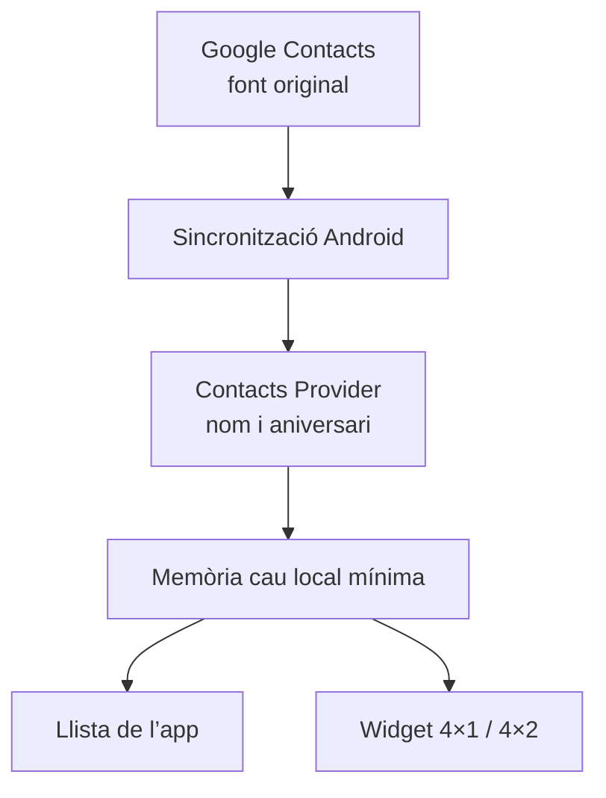

# Estudi i especificació de l’app d’aniversaris per a Android

**Data de l’estudi:** 22 d’agost de 2026  
**Objectiu:** una app Android personal, simple i fiable, centrada a mostrar els aniversaris desats als contactes de `felip.sarroca@gmail.com`, amb un widget semitransparent de quatre columnes d’amplada.

## 1. Conclusió executiva

La solució més adequada és una **app Android nativa en Kotlin**, sense servidor, sense compte propi, sense anuncis i sense analítica. La distribució tindrà dues etapes: primer un **APK signat publicat a GitHub Releases** i, quan el producte estigui prou provat, un **AAB a Google Play**.

L’app no hauria d’importar els contactes com una agenda independent ni connectar-se directament a Gmail. Hauria de:

1. llegir els aniversaris de l’**agenda local d’Android**, que ja rep els contactes sincronitzats del compte de Google;
2. filtrar els contactes que provenen de `felip.sarroca@gmail.com`;
3. desar en una base local només una **memòria cau mínima** dels aniversaris necessaris per ordenar-los i dibuixar el widget;
4. tornar a llegir els contactes a mitjanit, quan s’obre l’app i quan l’usuari demana una actualització;
5. actualitzar un widget redimensionable **4×1 / 4×2**, mostrant primer els aniversaris d’avui i després els més propers.
6. comprovar, de manera discreta i configurable, si existeix una versió nova sense enviar mai dades de contactes.

La idea essencial és aquesta: **Google Contacts continua sent la font original; l’app només n’és el visor i el recordatori.** Si s’edita una data, s’ha de fer al contacte original. Així no es creen dues agendes que acabin divergint.

La continuïtat entre GitHub i Google Play depèn d’una decisió irreversible que s’ha de prendre abans de publicar la primera APK: conservar sempre el mateix `applicationId`, la mateixa clau de signatura i una seqüència global de `versionCode` creixent. La clau privada no s’ha de pujar mai al repositori.

## 2. Què hi ha actualment al mercat

Les xifres són les que mostrava Google Play en la data de l’estudi i poden variar segons el país o el dispositiu.

| Aplicació | Implantació aproximada | Punts forts | Problemes o lliçons útils |
|---|---:|---|---|
| [Birthdays: Reminder & calendar](https://play.google.com/store/apps/details?id=com.marcow.birthdaylist) | 4,6; 319.000 ressenyes; 5 M+ descàrregues | Llistes, edats, cerca, còpies, diversos widgets; les dades són locals si l’usuari no activa sincronització | Alguns usuaris expliquen pèrdues o restauracions incompletes en canviar de telèfon i problemes ocasionals amb notificacions. Mostra que una còpia independent dels aniversaris crea riscos de divergència. |
| [Contacts’ Birthdays](https://play.google.com/store/apps/details?id=org.xjiop.contactsbirthdays) | 4,8; 11.000 ressenyes; 100.000+ descàrregues | Sincronització des de contactes, widget, notificacions, editor i notes | Ressenyes de 2025 descriuen widgets buits, congelats o que deixen d’actualitzar-se després d’una versió d’Android. També es demana una llista més compacta i que mostri l’edat que es complirà, no l’edat actual. |
| [Birday](https://play.google.com/store/apps/details?id=com.minar.birday) | 5,0; prop de 4.900 ressenyes; 50.000+ descàrregues | Codi obert, sense anuncis, Material 3, widgets, importació automàtica, detecció de duplicats, edats i exportació | Una ressenya explica que editar el nom d’un contacte va crear un duplicat. El mateix desenvolupador adverteix que Xiaomi, Huawei i OnePlus poden impedir processos de fons. |
| [Birthday Info Widget](https://play.google.com/store/apps/details?id=de.hambuch.birthdayinfo) | 4,4; prop de 2.500 ressenyes; 100.000+ descàrregues | És molt minimalista, sense anuncis i llegeix directament l’agenda Android | Les queixes més repetides són exactament les més greus per a aquest projecte: el widget no canvia de dia, no elimina dates passades o només es corregeix en obrir la configuració. El desenvolupament actiu ha finalitzat. |
| [Birthday Reminder Widget](https://play.google.com/store/apps/details?id=app.birthdayreminder.android) | 4,7; prop de 4.100 ressenyes; 100.000+ descàrregues | Widget cuidat, compte al núvol, sincronització entre dispositius, calendari i recordatoris | Afegeix compte, núvol, compres i funcions alienes a la necessitat principal. La fitxa declara recopilació i compartició de diverses categories de dades. És més complex del necessari. |
| [Birthdays & Events](https://play.google.com/store/apps/details?id=org.vovka.birthdaycountdown) | 3,4; prop de 260 ressenyes; 10.000+ descàrregues | Moltes fonts, formats i widgets configurables; declara no recopilar dades | És un exemple de sobrecàrrega: calendaris, aniversaris de casament, efemèrides, zodíac, concursos, frases i molts paràmetres. Té potència, però s’allunya de la simplicitat buscada. |

### Conclusions de les valoracions

Els usuaris valoren molt:

- veure els aniversaris sense obrir l’app;
- la simplicitat;
- que es mostri l’**edat que es complirà**;
- poder importar o llegir contactes;
- no tenir anuncis ni compte obligatori;
- un widget compacte i configurable.

Les queixes que es repeteixen són:

- el widget queda buit, congelat o mostra el dia anterior;
- les notificacions fallen per les restriccions de bateria del fabricant;
- apareixen duplicats després d’editar o tornar a sincronitzar un contacte;
- l’edat mostrada és l’actual en comptes de la que es complirà;
- en canviar de telèfon es perden dades guardades només dins de l’app;
- les aplicacions acaben incorporant massa funcions, publicitat o núvol.

Per tant, la prioritat no ha de ser afegir opcions, sinó resoldre molt bé quatre coses: **font de dades única, eliminació de duplicats, canvi de dia fiable i widget llegible.**

## 3. Què ens ensenyen les captures aportades

### Aspectes que convé conservar

- Fons fosc semitransparent i cantonades arrodonides.
- Quatre persones visibles sense haver d’obrir l’app.
- Edat, proximitat temporal i nom en una sola línia.
- El nom d’avui destacat en negreta.
- Accés a la llista completa tocant el widget.

### Aspectes que cal corregir

- A la segona captura, la mateixa persona apareix quatre vegades: la deduplicació és imprescindible.
- Repetir `08/24`, `2 days` i `13` en quatre files idèntiques ocupa espai sense aportar informació.
- El nom queda tallat massa aviat tot i haver-hi espai disponible.
- L’avatar genèric és massa gran en relació amb la informació.
- La barreja d’anglès i format nord-americà de data no és adequada: l’app ha de parlar en català i mostrar `24 d’ag.` o `24/08`.
- El primer widget és més net, però l’ordre `edat + in 3 days + nom` obliga a llegir-lo com una taula. És millor prioritzar visualment el nom i situar l’edat al final.

## 4. Abast funcional recomanat

### Imprescindible per a la primera versió

- Permetre lectura dels contactes després d’una explicació clara.
- Seleccionar i recordar el compte `felip.sarroca@gmail.com`.
- Llegir només esdeveniments de tipus **aniversari**.
- Mostrar una llista circular des d’avui fins als pròxims dotze mesos.
- Agrupar per `Avui`, `Demà` i data.
- Calcular l’edat que es complirà quan el contacte tingui any de naixement.
- Mostrar `—` o no mostrar cap edat quan només hi hagi dia i mes.
- Cercar per nom.
- Saltar a una data mitjançant un selector de data.
- Actualització manual arrossegant la llista cap avall.
- Widget redimensionable 4×1 i 4×2.
- Eliminació automàtica de duplicats.
- Pantalles d’estat clares si no hi ha permís, no hi ha contactes o la sincronització encara no s’ha fet.

### Interessant, però opcional

- Una notificació diària a una hora triada, desactivada per defecte.
- Obrir la fitxa original del contacte tocant una persona dins de l’app.
- Botó per compartir una felicitació mitjançant les apps instal·lades, sense missatges prefabricats ni IA.
- Ignorar manualment un registre concret si la deduplicació automàtica no resol un cas estrany.

### Funcions que no recomano

- Compte propi o registre.
- Servidor, Supabase o Firebase.
- Sincronització pròpia al núvol.
- Editor complet de contactes dins de l’app.
- Regals, zodíac, notes, efemèrides, aniversaris de casament o xarxes socials.
- Calendari mensual complex si un selector de data ja resol la consulta.
- Anuncis, analítica o seguiment d’ús.

## 5. On han de viure les dades

### Opcions estudiades

| Opció | Avantatges | Inconvenients | Valoració |
|---|---|---|---|
| Llegir directament l’agenda Android | Simple; funciona sense Internet; no necessita OAuth; aprofita la sincronització de Google | Cal permís `READ_CONTACTS`; el widget no hauria de fer consultes pesades cada vegada | **Recomanada com a font original** |
| Importar i copiar tots els aniversaris dins de l’app | Widget molt ràpid; permet editar independentment | Les dades queden duplicades, poden quedar obsoletes i cal còpia/restauració | No com a font original; només una memòria cau mínima |
| Connectar-se a Google People API | Accés directe al compte concret i sincronització incremental | Inici de sessió, Internet, projecte Google Cloud, OAuth amb abast sensible i verificació; més punts de fallada | Desproporcionada per a una app personal |
| Llegir Google Calendar | Pot aprofitar el calendari “Aniversaris” | Depèn d’una capa addicional de sincronització, pot barrejar fonts i normalment no ofereix l’edat de manera directa | Alternativa inferior |

Google explica que els aniversaris afegits als contactes se sincronitzen amb el calendari, però també permet activar o desactivar aquesta sincronització per compte. La font real continua sent Google Contacts. Android ofereix, al seu torn, el tipus de dada `ContactsContract.CommonDataKinds.Event.TYPE_BIRTHDAY` i exigeix `READ_CONTACTS` per consultar-la. Fonts: [Google Calendar Help](https://support.google.com/calendar/answer/13748346?co=GENIE.Platform%3DAndroid&hl=en), [Android Event API](https://developer.android.com/reference/android/provider/ContactsContract.CommonDataKinds.Event) i [Android Contacts Provider](https://developer.android.com/identity/providers/contacts-provider).

### Arquitectura recomanada

La base local pot ser Room i ha de contenir només:

- identificador estable o clau de consulta del contacte;
- nom visible;
- dia, mes i, si existeix, any de naixement;
- URI de foto opcional, sense copiar la fotografia;
- compte d’origen;
- moment de la darrera sincronització;
- identificadors de les files originals agrupades com a duplicades.

No cal desar telèfons, correus, adreces ni notes. Si es revoca el permís de contactes, l’app ha d’esborrar aquesta memòria cau i deixar el widget en estat “Cal donar permís”. La base de dades de contactes no s’ha d’incloure en la còpia automàtica d’Android, perquè es pot reconstruir.

## 6. Selecció del compte de Google

Android representa cada origen com un **raw contact** associat a un nom i un tipus de compte. La documentació oficial indica que, per a un compte de Google, `ACCOUNT_NAME` és normalment l’adreça Gmail i `ACCOUNT_TYPE` és `com.google`. Per tant, l’app pot seleccionar els raw contacts de:

- `ACCOUNT_NAME = felip.sarroca@gmail.com`
- `ACCOUNT_TYPE = com.google`

i consultar després les seves files d’aniversari. Font: [ContactsContract.RawContacts](https://developer.android.com/reference/android/provider/ContactsContract.RawContacts).

En la primera execució, l’app ha de mostrar els comptes de contactes detectats i preseleccionar `felip.sarroca@gmail.com`. Això evita codificar una dada personal de manera rígida i permet reinstal·lar l’app en un altre dispositiu.

Android 17 restringeix alguns camps d’identificació del compte en la vista agregada de dades. Per reduir el risc de compatibilitat, la implementació ha de consultar primer els raw contacts del compte i, a continuació, les dades associades als seus identificadors, en comptes de dependre de `ACCOUNT_NAME` dins de la vista general `Data`. Font: [canvis d’Android 17](https://developer.android.com/about/versions/17/behavior-changes-17).

## 7. Deduplicació correcta

La segona captura demostra que no n’hi ha prou d’ordenar el resultat de la consulta. Android pot agregar diverses fitxes d’origen en un sol contacte i una mateixa data pot aparèixer en més d’una fila.

La deduplicació ha de seguir aquest ordre:

1. **Duplicat tècnic segur:** mateixa fila o mateix identificador d’origen; conservar-ne una.
2. **Mateix contacte agregat:** mateix `CONTACT_ID` o `LOOKUP_KEY` i mateixa data normalitzada; conservar-ne una.
3. **Duplicat aparent:** nom normalitzat igual i mateixa data completa; agrupar-lo per defecte i conservar internament totes les fonts.
4. Si només coincideixen nom, dia i mes però no hi ha any, agrupar-los només quan siguin del mateix compte i el nom coincideixi exactament després de normalitzar espais, majúscules i accents.
5. Permetre veure en una petita pantalla de diagnòstic els “duplicats agrupats” i separar-los manualment si alguna vegada fossin dues persones reals.

La clau persistent no ha de dependre només del nom, perquè editar “Eric Sánchez” a “Eric Sánchez González” no ha de crear un aniversari nou. Birday té una ressenya que descriu precisament aquest problema. L’app ha d’utilitzar els identificadors del proveïdor de contactes i el conjunt de fonts agrupades.

## 8. Càlcul de dates i edats

Per a cada aniversari s’ha de calcular la pròxima ocurrència en relació amb la zona horària local del dispositiu:

- si el dia i el mes encara no han passat aquest any, la pròxima data és aquest any;
- si ja han passat, és l’any següent;
- `diesRestants = 0` significa **Avui**;
- si hi ha any de naixement, `edatQueCompleix = anyDeLaPròximaOcurrència − anyDeNaixement`;
- si falta l’any, no s’ha d’inventar cap edat;
- una data invàlida ha d’aparèixer en un apartat de revisió, no al widget;
- el 29 de febrer s’ha de tractar explícitament. Per simplicitat, proposo recordar-lo el 28 de febrer en anys no bixests i indicar aquesta regla als ajustos.

S’han d’acceptar dates amb any i dates sense any. La documentació d’Android avisa que `START_DATE` és text “tal com l’ha introduït l’usuari”; per tant, el lector ha de normalitzar els formats habituals i no assumir cegament un sol patró.

## 9. Disseny de l’app

### Pantalla principal única

Capçalera:

- títol **Aniversaris**;
- icona de calendari per saltar a una data;
- menú discret d’ajustos;
- text petit `Actualitzat avui a les 00.00` o l’hora real de l’última lectura.

Contingut:

- secció `Avui · dissabte 22 d’agost`;
- secció `Demà · diumenge 23 d’agost`;
- després, capçaleres de data consecutives només quan hi hagi aniversaris;
- cada fila: avatar petit opcional, nom, text temporal i edat que es complirà;
- exemple: `Paula Moya Postigo — avui · 24 anys`;
- exemple: `Eric Sánchez González — d’aquí a 2 dies · 13 anys`;
- exemple sense any: `Marta Garcia — 26 d’agost`.

Una cerca per nom pot aparèixer en tocar la lupa. El selector de data ha de desplaçar la mateixa llista fins al dia triat; no cal crear una segona pantalla complicada.

### Estil

- Material 3, català, mode clar i fosc.
- Tipografia del sistema, amb jerarquia clara i sense decoració infantil excessiva.
- Color d’accent càlid —corall o taronja suau— només per a `Avui` i elements interactius.
- Fotografies opcionals; si no n’hi ha, monograma de color, no silueta genèrica enorme.
- Accessibilitat: text escalable, contrast suficient i informació que no depengui només del color.

## 10. Especificació del widget

Android defineix els widgets com a vistes “d’un cop d’ull” i, des d’Android 12, permet layouts responsius per adaptar-se a diferents mides. Recomano un sol widget redimensionable amb dos layouts. Fonts: [widgets Android](https://developer.android.com/develop/ui/views/appwidgets/overview), [layouts flexibles](https://developer.android.com/develop/ui/views/appwidgets/layouts) i [Jetpack Glance](https://developer.android.com/develop/ui/compose/glance/build-ui).

### Mida 4×1 — compacta

- Quatre columnes d’amplada i una d’alçada.
- Fins a quatre files molt compactes.
- Sense capçalera fixa: tot l’espai és per a persones.
- Cada fila reserva aproximadament:

| Zona | Contingut | Prioritat |
|---|---|---|
| Esquerra, 52–58% | Nom, una sola línia amb el·lipsi final | Màxima |
| Centre, 24–28% | `Avui`, `Demà`, `3 dies` o `26 ag.` | Alta |
| Dreta, 16–20% | `24 anys` o `—` | Mitjana |

- La fila d’avui usa seminegreta i un accent molt discret.
- Si hi ha més aniversaris avui dels que hi caben: mostrar tres persones i una quarta fila `+N més avui`.
- Si hi ha menys aniversaris avui, omplir les files restants amb les dates següents.

### Mida 4×2 — ampliada

- Entre sis i vuit files segons l’escala de text.
- Pot incloure avatar de 28–32 dp.
- Admet una capçalera mínima `Avui i pròxims` i l’hora de la darrera actualització.
- Si hi ha molts aniversaris avui, es prioritzen tots els que càpiguen abans dels dies futurs.

### Aparença

- Rectangle amb cantonades del radi recomanat pel sistema.
- Fons negre o gris fosc amb una opacitat inicial aproximada del **72%**.
- Text blanc principal i blanc atenuat secundari.
- La configuració del widget només necessita tres controls: `Fosc / clar / sistema`, transparència i `mostrar avatars`.
- No s’ha de prometre desenfocament real del fons: els launchers no l’ofereixen de manera uniforme. El resultat fiable és un color semitransparent amb bon contrast.
- Android recomana colors Material amb contrast accessible i compatibilitat amb color dinàmic. Font: [guia d’estil de widgets](https://developer.android.com/design/ui/mobile/guides/widgets/style).

### Interacció

- Tocar qualsevol zona buida o el fons obre la pantalla principal posicionada a `Avui`.
- Tocar una fila pot obrir l’app centrada en aquella data.
- No calen botons petits dins del widget.
- Quan no hi ha aniversaris pròxims: `Cap aniversari en els pròxims 30 dies` i, a sota, el següent disponible.
- Quan falta permís: `Dona accés als contactes`.
- Quan hi ha un error d’actualització: conservar les últimes dades vàlides i mostrar un petit indicador, mai un widget completament buit.

## 11. Actualització fiable a les 00.00 h

Aquest és el punt tècnic més delicat. Les ressenyes del mercat mostren que molts widgets fallen justament aquí.

`updatePeriodMillis` no pot baixar de 30 minuts i les tasques de WorkManager no tenen hora exacta garantida; Android pot ajornar-les per optimització de bateria. Fonts: [actualització avançada de widgets](https://developer.android.com/develop/ui/views/appwidgets/advanced) i [WorkManager](https://developer.android.com/develop/background-work/background-tasks/persistent/getting-started/define-work).

Per complir l’objectiu, proposo:

1. Programar amb AlarmManager una actualització a **00:00:05** de la zona horària local.
2. Demanar una sola vegada l’accés especial `SCHEDULE_EXACT_ALARM` amb una explicació: “per canviar el widget en començar el dia”.
3. Abans de dibuixar, recalcular les dates des de la memòria cau i intentar refrescar els contactes.
4. Programar immediatament l’alarma de la nit següent.
5. Reprogramar-la després d’un reinici, canvi manual d’hora o canvi de zona horària.
6. Afegir una tasca periòdica de seguretat i actualitzar sempre en obrir l’app o en afegir/redimensionar el widget.
7. Si l’usuari no concedeix alarmes exactes, usar una actualització aproximada i explicar que pot arribar uns minuts tard.

Android 14 i posteriors no concedeixen per defecte les alarmes exactes a la majoria d’apps; cal comprovar el permís abans de programar-les. Android també recomana reservar-les a funcions visibles per a l’usuari. En aquest cas, el canvi diari del widget és la funció principal. Fonts: [canvis d’Android 14](https://developer.android.com/about/versions/14/changes/schedule-exact-alarms) i [guia d’AlarmManager](https://developer.android.com/develop/background-work/services/alarms).

### Consideració especial per al Xiaomi

Com que el dispositiu de destí és Xiaomi, la primera execució ha d’incloure una comprovació curta amb quatre estats:

- Contactes: concedit.
- Alarmes i recordatoris: concedit.
- Bateria: recomanació d’ús sense restriccions.
- Widget: afegit o pendent.

No s’ha d’obligar a mantenir l’app oberta ni un servei permanent. La memòria cau garanteix que, si una lectura puntual dels contactes falla, el widget conservi l’última informació vàlida. Un botó `Comprova ara` ha d’actualitzar dades i widget i confirmar el resultat.

## 12. Permisos i privadesa

### Permisos necessaris

- `READ_CONTACTS`: imprescindible i demanat en context, després d’explicar què es llegirà.
- `SCHEDULE_EXACT_ALARM`: necessari si es vol garantir el canvi just a mitjanit; es pot continuar amb precisió menor si es denega.
- `RECEIVE_BOOT_COMPLETED`: per reprogramar l’actualització després de reiniciar.
- `INTERNET` i `ACCESS_NETWORK_STATE`: només per consultar metadades d’una versió nova i iniciar-ne la descàrrega quan l’usuari ho demani. La funció principal continua funcionant sense connexió.
- `POST_NOTIFICATIONS`: només si més endavant s’activa voluntàriament una notificació.

### Permisos que no calen

- Escriptura de contactes.
- Calendari.
- Ubicació.
- Telèfon, SMS o registre de trucades.
- Fotos o emmagatzematge.
- `REQUEST_INSTALL_PACKAGES` a la variant de Google Play. La política de Play no permet usar aquest permís per autoactualitzar l’app.

La variant de GitHub tampoc necessita obligatòriament `REQUEST_INSTALL_PACKAGES`: la solució inicial més segura és obrir la pàgina o la descàrrega del nou APK al navegador i deixar que Android demani la confirmació d’instal·lació. Si més endavant es vol fer tota la descàrrega dins de l’app, aquest permís només es podrà incloure en la variant GitHub, mai en la variant Play, i la instal·lació continuarà requerint una acció explícita de l’usuari.

La pantalla de permís ha de dir de manera explícita: `L’app només llegeix nom i aniversari dels contactes del compte seleccionat. No envia dades fora del telèfon.`

## 13. Tecnologia i lliurament

### Pila recomanada

- Kotlin.
- Android Studio i Gradle.
- Jetpack Compose + Material 3 per a l’app.
- Jetpack Glance per al widget, amb layouts responsius.
- Room per a la memòria cau mínima.
- DataStore per a compte triat i preferències del widget.
- AlarmManager per al canvi de dia.
- WorkManager només com a xarxa de seguretat, no com a rellotge exacte.
- Una interfície `UpdateProvider` amb dues implementacions separades: `GitHubUpdateProvider` i `PlayUpdateProvider`.

### Distribució en dues etapes

| Etapa | Artefacte | Canal | Actualització recomanada |
|---|---|---|---|
| Inicial i proves personals | APK release signat | GitHub Releases | Consulta l’última release de GitHub, mostra notes i obre la descàrrega només quan l’usuari ho accepta |
| Publicació pública | AAB | Google Play | Play In-App Updates, preferentment modalitat flexible; Google Play descarrega, verifica i instal·la |

S’han de generar dues variants del mateix projecte, `githubRelease` i `playRelease`. Han de compartir codi, base de dades, `applicationId`, numeració i clau de signatura, però cada una incorpora exclusivament el seu proveïdor d’actualitzacions. Això evita que la versió de Play infringeixi la política descarregant APK externes.

### Identitat, signatura i versions

Abans de la primera publicació s’ha de fixar l’identificador definitiu —per exemple, `cat.felipsarroca.aniversaris`, subjecte a confirmació— i crear la clau definitiva de signatura. Android només accepta una actualització si l’APK nou té el mateix identificador i està signat amb el mateix certificat; el `versionCode` també ha de ser superior.

Regles obligatòries:

- no canviar mai l’`applicationId` després de la primera versió instal·lable;
- custodiar la clau de signatura fora del repositori, amb dues còpies xifrades i la contrasenya en un gestor de contrasenyes;
- signar totes les APK de GitHub amb aquesta mateixa clau;
- usar una única seqüència de `versionCode` per als dos canals;
- usar `versionName` llegible, preferentment semàntic: `1.0.0`, `1.1.0`, `1.1.1`;
- quan es creï l’app a Play Console, triar l’opció d’utilitzar la **clau de signatura existent** a Play App Signing i crear una clau de pujada separada;
- no publicar mai el fitxer `.jks`, les contrasenyes ni secrets dins de GitHub.

Si Google Play generés una clau de signatura nova, els paquets de Play i de GitHub tindrien signatures diferents i no podrien substituir-se mútuament. Per això la decisió de la clau s’ha de prendre des del començament.

### GitHub Releases i comprovació d’actualitzacions

L’APK no s’ha de desar com un binari dins de l’historial Git. Cada versió s’ha de publicar com una **GitHub Release** amb:

- `aniversaris-v1.0.0.apk`;
- `aniversaris-v1.0.0.apk.sha256`;
- notes de la versió en català;
- etiqueta Git corresponent, com ara `v1.0.0`.

La pantalla `Ajustos > Actualitzacions` ha de mostrar la versió instal·lada, el canal actual, `Comprova ara` i la freqüència automàtica: `Mai`, `Setmanal` —valor recomanat— o `En obrir l’app`. La comprovació setmanal pot usar WorkManager amb xarxa disponible i consultar l’endpoint públic `GET /repos/{propietari}/{repositori}/releases/latest`. La comparació s’ha de fer amb un `versionCode` inequívoc publicat a les metadades de la release, no ordenant textos com `1.10` i `1.9`.

Quan hi hagi una versió nova, l’app mostrarà número, canvis i mida i demanarà confirmació. No farà mai instal·lacions silencioses. Abans d’una instal·lació gestionada dins de la variant GitHub, cal verificar que el nom del paquet coincideix, que el `versionCode` és superior, que el SHA-256 coincideix i que el certificat és el mateix que el de l’app instal·lada. Un error conserva la versió actual i mostra un missatge comprensible.

### Google Play i extensibilitat

La publicació posterior és tècnicament possible. La variant `playRelease` ha d’usar **Play In-App Updates** i no ha de contenir codi ni permisos per instal·lar APK externes. La modalitat flexible és la més adequada: la descàrrega es fa en segon pla i l’usuari confirma el reinici quan està preparada.

Per publicar caldrà, a més de l’AAB:

- compte de Play Console, pagament únic i verificacions d’identitat i dispositiu;
- fitxa, icona, captures i dades de contacte;
- política de privadesa pública en una URL web i formulari Data Safety coherent;
- proves tancades exigides al tipus i antiguitat del compte —actualment, per a molts comptes personals nous, dotze verificadors durant catorze dies seguits—;
- declaració i justificació de `READ_CONTACTS`.

La darrera obligació és el principal risc de revisió. Per a apps orientades a Android 17/API 37 o superior, Google Play exigeix justificar per què el selector limitat de contactes no és suficient. Aquí l’argument és funcional: l’app ha de detectar automàticament tots els aniversaris del compte i mantenir el widget actualitzat; obligar l’usuari a seleccionar manualment cada contacte destruiria aquesta funció principal. Aquesta finalitat s’ha de descriure de manera destacada a la fitxa i a la pantalla prèvia al permís. Convindrà, tanmateix, mantenir la font de contactes darrere d’una interfície perquè es pugui afegir un mode de selecció manual si Play canviés el criteri o rebutgés l’accés ampli.

### Format de lliurament

Per instal·lar-la personalment al mòbil, el format correcte és un **APK release signat**. S’ha de conservar el fitxer de signatura i la contrasenya: totes les actualitzacions futures hauran d’estar signades amb la mateixa clau. Si algun dia es publica a Google Play, també es generarà un **AAB**, però l’AAB no substitueix l’APK per a una instal·lació directa.

Versió mínima raonable: Android 8 o superior; versió objectiu: la més recent exigida per Android/Google Play en el moment de compilar. Cal provar específicament:

- Xiaomi/HyperOS del dispositiu real;
- Android 14, 15, 16 i 17;
- launcher Xiaomi i un launcher Android de referència;
- mode clar/fosc i diversos fons de pantalla;
- escala de lletra normal i gran.

## 14. Criteris d’acceptació

La primera versió es pot considerar acabada quan superi, com a mínim, aquestes proves:

1. Llegeix exclusivament aniversaris del compte seleccionat.
2. Un contacte amb la mateixa data repetida en diverses fonts apareix una sola vegada.
3. Editar el nom d’un contacte no crea un duplicat.
4. El 31 de desembre ordena correctament els aniversaris de l’1 de gener.
5. L’edat és la que es complirà, no l’edat anterior.
6. Sense any de naixement no mostra edats absurdes.
7. A les 00.00 h canvien `Demà`, `Avui` i els dies restants sense obrir l’app.
8. Després de reiniciar el mòbil, l’actualització nocturna continua programada.
9. Si Android mata el procés, el widget conserva les dades i es recupera automàticament.
10. Si es revoca el permís de contactes, no es mostren dades antigues.
11. Si un dia hi ha més aniversaris dels que caben, el widget indica clarament que n’hi ha més i un toc mostra la llista completa.
12. El widget mai queda buit per un error transitori si encara existeix una última lectura vàlida.
13. El text és llegible sobre un fons de pantalla clar i un de fosc.
14. El widget 4×1 mostra quatre files amb l’escala de text normal del Xiaomi.
15. La consulta completa no congela la interfície.
16. Una APK nova amb el mateix paquet, certificat i `versionCode` superior substitueix l’anterior sense perdre preferències, memòria cau ni configuració del widget.
17. La variant GitHub detecta una release superior, mostra les notes i només inicia la descàrrega després d’una acció de l’usuari.
18. Una release igual, anterior, esborrany o prerelease no es presenta com a actualització estable.
19. La variant Play no conté `REQUEST_INSTALL_PACKAGES`, no consulta GitHub per instal·lar APK i actualitza mitjançant Google Play.
20. Una APK amb identificador o signatura diferents és rebutjada i l’app no proposa substituir la instal·lació actual.

## 15. Decisió final de producte

La millor app per a aquest cas no és la que té més funcions. És la que es pot instal·lar, autoritzar i oblidar perquè cada matí el widget diu la veritat.

La primera versió hauria de limitar-se a:

- una sola font: Google Contacts sincronitzat amb Android;
- una sola pantalla principal;
- un selector de data i una cerca;
- un widget 4×1 / 4×2 molt cuidat;
- edats correctes;
- deduplicació robusta;
- actualització nocturna redundant;
- dades exclusivament locals.
- distribució inicial mitjançant GitHub Releases i una ruta segura cap a Google Play;
- comprovació d’actualitzacions configurable, sense instal·lacions silencioses ni transmissió de contactes.

Aquesta combinació resol exactament el problema plantejat i evita els errors que apareixen de manera recurrent a les ressenyes de les aplicacions existents.

## Fonts principals consultades

- [Google Play — Birthdays: Reminder & calendar](https://play.google.com/store/apps/details?id=com.marcow.birthdaylist)
- [Google Play — Contacts’ Birthdays](https://play.google.com/store/apps/details?id=org.xjiop.contactsbirthdays)
- [Google Play — Birday](https://play.google.com/store/apps/details?id=com.minar.birday)
- [Google Play — Birthday Info Widget](https://play.google.com/store/apps/details?id=de.hambuch.birthdayinfo)
- [Google Play — Birthday Reminder Widget](https://play.google.com/store/apps/details?id=app.birthdayreminder.android)
- [Google Play — Birthdays & Events](https://play.google.com/store/apps/details?id=org.vovka.birthdaycountdown)
- [Android Developers — Contacts Provider](https://developer.android.com/identity/providers/contacts-provider)
- [Android Developers — Event.TYPE_BIRTHDAY](https://developer.android.com/reference/android/provider/ContactsContract.CommonDataKinds.Event)
- [Android Developers — RawContacts](https://developer.android.com/reference/android/provider/ContactsContract.RawContacts)
- [Android Developers — App widgets](https://developer.android.com/develop/ui/views/appwidgets/overview)
- [Android Developers — Actualització de widgets](https://developer.android.com/develop/ui/views/appwidgets/advanced)
- [Android Developers — AlarmManager](https://developer.android.com/develop/background-work/services/alarms)
- [Android Developers — Alarmes exactes a Android 14](https://developer.android.com/about/versions/14/changes/schedule-exact-alarms)
- [Android Developers — WorkManager](https://developer.android.com/develop/background-work/background-tasks/persistent/getting-started/define-work)
- [Google Calendar Help — aniversaris](https://support.google.com/calendar/answer/13748346?co=GENIE.Platform%3DAndroid&hl=en)
- [Google People API — connections.list](https://developers.google.com/people/api/rest/v1/people.connections/list)
- [Android Developers — signatura d’apps](https://developer.android.com/studio/publish/app-signing)
- [Android Developers — configuració de l’application ID](https://developer.android.com/build/configure-app-module)
- [Android Developers — Play In-App Updates](https://developer.android.com/guide/playcore/in-app-updates)
- [GitHub Docs — sobre les Releases](https://docs.github.com/en/repositories/releasing-projects-on-github/about-releases)
- [GitHub REST API — última release](https://docs.github.com/rest/releases/releases#get-the-latest-release)
- [Google Play — política de REQUEST_INSTALL_PACKAGES](https://support.google.com/googleplay/android-developer/answer/17190352)
- [Google Play — crear el compte de desenvolupador](https://support.google.com/googleplay/android-developer/answer/6112435)
- [Google Play — requisits de proves per a comptes personals](https://support.google.com/googleplay/android-developer/answer/14151465)
- [Google Play — política de dades d’usuari](https://support.google.com/googleplay/android-developer/answer/10144311)
- [Google Play — política de permisos de contactes](https://support.google.com/googleplay/android-developer/answer/16935362)
