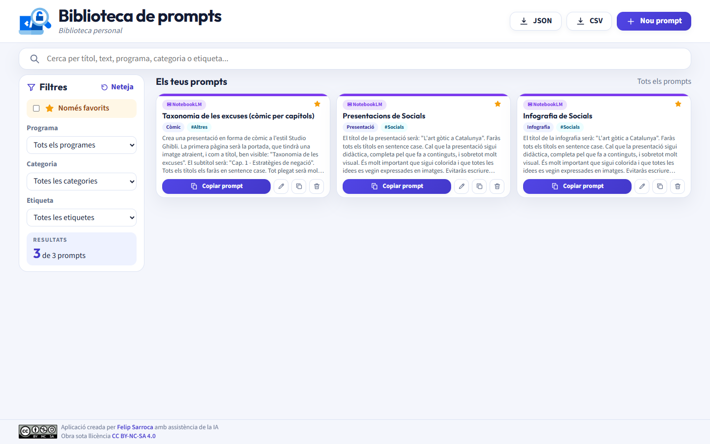
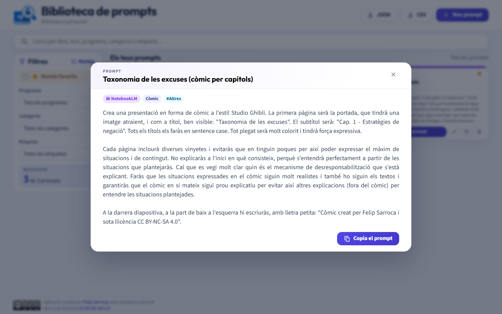
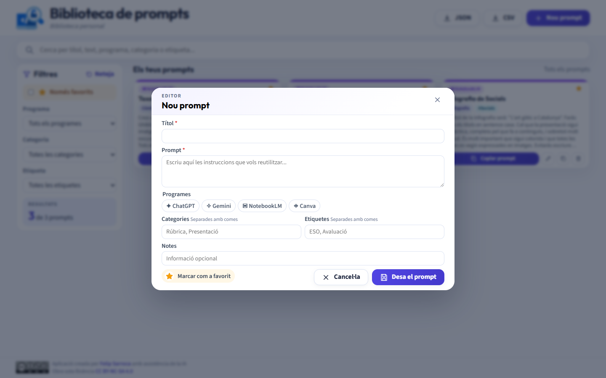

# BiblioPrompt

Biblioteca web personal per recollir, editar, cercar i reutilitzar prompts. L'aplicació desa les dades en un Google Sheets mitjançant una API de Google Apps Script i es publica com a lloc web estàtic.

[Obre l'aplicacio](https://ja.cat/biblioprompt)

## Captures de pantalla

### Biblioteca i filtres



### Lectura completa i còpia ràpida



### Creació i edició



## Funcionalitats

- Creació, edició, duplicació i eliminació de prompts.
- Visualització completa en un visor emergent i còpia ràpida al porta-retalls.
- Cerca instantània per títol, contingut, programa, categoria o etiqueta.
- Filtres per programa, categoria, etiqueta i favorits.
- Assignació de diversos programes a un mateix prompt.
- Marcatge de prompts favorits.
- Historial automatic de versions quan es modifica o s'elimina un prompt.
- Exportació de les dades en formats JSON i CSV.
- Interfície adaptable a ordinador i dispositius mòbils.

## Funcionament

```text
Navegador
  |  GET (JSONP) / POST
  v
Google Apps Script
  |
  v
Google Sheets
  |- Prompts
  |- Programes
  `- Historial
```

El frontend és una aplicació HTML, CSS i JavaScript sense compilació. Quan `useGoogleSheets` està activat, [js/api.js](js/api.js) consulta i modifica les dades a través del desplegament públic definit a [js/config.js](js/config.js).

L'API a [apps-script/Code.gs](apps-script/Code.gs):

- Inicialitza les pestanyes requerides si no existeixen.
- Llegeix prompts, programes i historial.
- Crea, actualitza i elimina prompts.
- Desa versions anteriors a `Historial`.
- Manté els programes inicials disponibles.

## Dades de Google Sheets

### `Prompts`

| Camp | Descripcio |
| --- | --- |
| `id` | Identificador únic del prompt |
| `title` | Títol visible |
| `content` | Text complet del prompt |
| `programIds` | Identificadors dels programes, en format JSON |
| `categories` | Categories, en format JSON |
| `tags` | Etiquetes, en format JSON |
| `notes` | Notes opcionals |
| `favorite` | Estat de favorit |
| `createdAt` | Data de creació |
| `updatedAt` | Data de darrera actualització |
| `version` | Número de versió |

### `Programes`

Conté els programes seleccionables, amb els camps `id`, `name`, `icon` i `color`. La configuració inicial inclou ChatGPT, Gemini, NotebookLM i Canva.

### `Historial`

Conserva versions substituïdes o eliminades dels prompts, afegint `historyId`, `promptId` i `replacedAt`.

## Estructura del projecte

```text
BiblioPrompt/
|- index.html                 # Interfície principal
|- css/styles.css             # Estils de l'aplicació
|- js/
|  |- app.js                  # Renderitzat, filtres i interacció
|  |- api.js                  # Lectura i escriptura de dades
|  |- config.js               # Configuració del backend
|  |- seed-data.js            # Dades locals inicials
|  `- utils.js                # Utilitats compartides
|- apps-script/
|  |- Code.gs                 # API de Google Apps Script
|  `- appsscript.json         # Manifest de l'script
|- docs/screenshots/          # Captures utilitzades en aquest README
`- CONFIGURACIO_GOOGLE_SHEETS.md
```

## Execució local

Com que el frontend utilitza moduls JavaScript, cal servir-lo per HTTP:

```bash
npx serve .
```

Després, obre l'adreça local que indiqui el servidor.

La configuració activa usa Google Sheets:

```js
export const CONFIG = {
  useGoogleSheets: true,
  appsScriptUrl: "URL_DEL_DESPLEGAMENT_APPS_SCRIPT",
  localStorageKey: "biblioprompt_data_v1"
};
```

Per treballar sense Google Sheets, estableix temporalment `useGoogleSheets: false`; les dades es desaran al `localStorage` del navegador.

## Configuració de Google Sheets

La guia detallada per crear o actualitzar el backend es troba a [CONFIGURACIO_GOOGLE_SHEETS.md](CONFIGURACIO_GOOGLE_SHEETS.md).

Resum:

1. Crea un Google Sheets i un projecte d'Apps Script associat.
2. Puja el contingut d'[apps-script/Code.gs](apps-script/Code.gs) amb `clasp`.
3. Publica l'script com a aplicació web executable pel propietari i, en la configuració actual, accessible públicament.
4. Configura l'URL `/exec` del desplegament a [js/config.js](js/config.js).

## Seguretat i còpies de seguretat

El desplegament actual no incorpora autenticació pròpia. Si l'Apps Script es publica amb accés anònim, qualsevol persona que conegui l'URL de l'endpoint pot llegir o modificar les dades.

Per aquest motiu:

- No hi desis informacio sensible.
- Conserva còpies de seguretat mitjançant l'exportació JSON.
- Restringeix l'accés al desplegament si l'aplicació deixa de ser d'ús personal.

## Llicència

Aplicació creada per [Felip Sarroca](https://ja.cat/felipsarroca) amb assistència de la IA i publicada sota llicència [CC BY-NC-SA 4.0](https://creativecommons.org/licenses/by-nc-sa/4.0/deed.ca).
