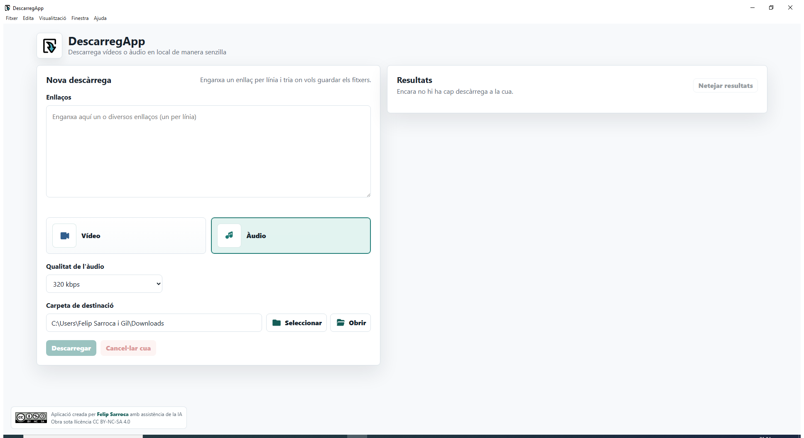

# DescarregApp

DescarregApp és una aplicació d'escriptori feta amb Electron per descarregar vídeos o àudio en local de manera senzilla. Fa servir `yt-dlp` com a motor de descàrrega i `FFmpeg` per convertir o fusionar fitxers.



## Característiques principals

- Descàrrega de vídeos en la millor qualitat disponible.
- Descàrrega d'àudio en MP3.
- Selector de qualitat d'àudio: `128`, `256` o `320 kbps`.
- Selector de format de vídeo: `MP4`, `MKV` o `AVI`.
- Cua de descàrregues seqüencial.
- Possibilitat d'afegir nous enllaços mentre una cua ja està en marxa.
- Camp d'enllaços que es buida automàticament quan s'afegeixen elements a la cua.
- Selector nadiu de carpeta de destinació.
- Botó per obrir directament la carpeta de descàrrega.
- Botó per cancel·lar la cua.
- Resultats amb estat, percentatge i barra de progrés.
- Detall desplegable d'errors.
- Preferències persistents.
- `yt-dlp` i `FFmpeg` inclosos dins l'instal·lador de Windows.

## Instal·lació per a usuaris

La manera recomanada d'instal·lar l'aplicació és descarregar l'instal·lador de Windows:

```text
DescarregApp-Setup.exe
```

Quan estigui publicat a GitHub Releases, l'enllaç estable recomanat serà:

```text
https://github.com/USUARI/REPOSITORI/releases/latest/download/DescarregApp-Setup.exe
```

Aquest és l'enllaç ideal per crear un accés directe amb `ja.cat`, per exemple:

```text
https://ja.cat/descarregapp
```

No cal instal·lar Node.js, `yt-dlp` ni `FFmpeg` a l'equip de l'usuari final. L'instal·lador ja inclou les eines necessàries.

## Ús bàsic

1. Obre DescarregApp.
2. Enganxa un o diversos enllaços, un per línia.
3. Tria `Vídeo` o `Àudio`.
4. Si tries `Vídeo`, selecciona `MP4`, `MKV` o `AVI`.
5. Si tries `Àudio`, selecciona `128`, `256` o `320 kbps`.
6. Selecciona la carpeta de destinació.
7. Prem `Descarregar`.

Els enllaços passaran al panell de resultats i el quadre d'entrada quedarà buit. Això permet enganxar nous enllaços mentre les descàrregues anteriors continuen a la cua.

## Gestió de la cua

DescarregApp processa les descàrregues de manera seqüencial. Això evita saturar la connexió i redueix problemes amb conversions simultànies.

Durant una descàrrega pots:

- afegir nous enllaços a la cua
- cancel·lar la cua
- obrir la carpeta de destinació
- consultar errors
- netejar els resultats quan no hi ha descàrregues en marxa

## Formats disponibles

### Vídeo

Formats seleccionables:

- `MP4`
- `MKV`
- `AVI`

`MP4` és l'opció recomanada per compatibilitat general. `MKV` és una bona opció si es vol conservar millor alguns fluxos d'àudio o vídeo. `AVI` és menys recomanable per a formats moderns, però està disponible.

### Àudio

Format final:

```text
MP3
```

Qualitats disponibles:

- `128 kbps`
- `256 kbps`
- `320 kbps`

## Preferències desades

L'aplicació recorda automàticament:

- carpeta de destinació
- últim mode triat: vídeo o àudio
- format de vídeo triat
- qualitat d'àudio triada

Electron desa aquestes preferències en un fitxer `config.json` dins la carpeta pròpia de l'aplicació.

Ubicacions habituals:

- Windows: `AppData/Roaming/DescarregApp`
- macOS: `Application Support/DescarregApp`

## Estructura del projecte

```text
DescarregApp/
├─ assets/
│  ├─ favicon.svg
├─ docs/
│  └─ images/
│     └─ descarregapp-main.png
├─ resources/
│  └─ bin/
│     └─ win/
│        ├─ ffmpeg.exe
│        └─ yt-dlp.exe
├─ scripts/
│  ├─ capture-window.ps1
│  ├─ download-tools.ps1
│  ├─ generate-icon.js
│  └─ generate-icon.ps1
├─ src/
│  ├─ main.js
│  ├─ preload.js
│  └─ renderer/
│     ├─ index.html
│     ├─ renderer.js
│     └─ styles.css
├─ package.json
├─ package-lock.json
└─ README.md
```

## Desenvolupament

### Requisits

Per desenvolupar l'aplicació cal tenir instal·lat:

- Node.js
- npm

Els binaris de `yt-dlp` i `FFmpeg` es poden descarregar amb un script del projecte.

### Instal·lació del projecte

```powershell
npm.cmd install
```

### Descarregar eines locals

```powershell
npm.cmd run tools:download
```

Això descarrega:

- `resources/bin/win/yt-dlp.exe`
- `resources/bin/win/ffmpeg.exe`

### Executar en mode desenvolupament

```powershell
npm.cmd start
```

## Construcció de l'instal·lador

Per generar l'instal·lador de Windows:

```powershell
npm.cmd run build:win
```

El fitxer final es genera a:

```text
dist/DescarregApp-Setup.exe
```

Aquest nom és fix expressament perquè l'enllaç de GitHub Releases pugui ser estable.

## Publicació a GitHub Releases

Flux recomanat:

1. Fes els canvis al projecte.
2. Comprova que l'app arrenca:

```powershell
npm.cmd start
```

3. Genera l'instal·lador:

```powershell
npm.cmd run build:win
```

4. Ves al repositori de GitHub.
5. Entra a `Releases`.
6. Crea una nova release, per exemple `v0.1.0`.
7. Adjunta aquest fitxer:

```text
dist/DescarregApp-Setup.exe
```

8. Publica la release.

Enllaç directe recomanat per a l'última versió:

```text
https://github.com/USUARI/REPOSITORI/releases/latest/download/DescarregApp-Setup.exe
```

Aquest és l'enllaç que pots fer servir a `ja.cat`.

## Què cal pujar a GitHub

Cal pujar:

- `assets/`
- `docs/`
- `scripts/`
- `src/`
- `.gitignore`
- `package.json`
- `package-lock.json`
- `README.md`

No cal pujar:

- `node_modules/`
- `dist/`
- `resources/bin/win/*.exe`
- `assets/icon.ico`
- `assets/icon.png`

La carpeta `dist/` només serveix per generar l'instal·lador localment. L'instal·lador final s'ha d'adjuntar a una release de GitHub.

Els binaris locals de `yt-dlp` i `FFmpeg` tampoc s'han de pujar al repositori. Especialment `ffmpeg.exe`, que pesa més de 100 MB i GitHub no l'accepta com a fitxer normal. Quan algú vulgui reconstruir l'app des del codi, haurà d'executar:

```powershell
npm.cmd run tools:download
```

L'usuari final no necessita fer això, perquè l'instal·lador publicat a GitHub Releases ja inclou aquestes eines.

## Icona de l'aplicació

La icona base que ha d'estar a GitHub és:

```text
assets/favicon.svg
```

`icon.png` i `icon.ico` són fitxers generats a partir de `favicon.svg`. No cal pujar-los a GitHub. Per regenerar-los localment:

```powershell
npm.cmd run icons:generate
```

## Captures del README

La captura principal es troba a:

```text
docs/images/descarregapp-main.png
```

Per generar una nova captura de la finestra oberta:

```powershell
powershell -ExecutionPolicy Bypass -File scripts/capture-window.ps1
```

## Consideracions legals i d'ús

DescarregApp és una eina local que facilita l'ús de `yt-dlp` i `FFmpeg`. L'usuari és responsable de fer-ne un ús correcte i respectar els drets d'autor, les llicències i les condicions d'ús de cada plataforma.

## Llicència

Aplicació creada per Felip Sarroca amb assistència de la IA.

Obra sota llicència:

```text
CC BY-NC-SA 4.0
```
