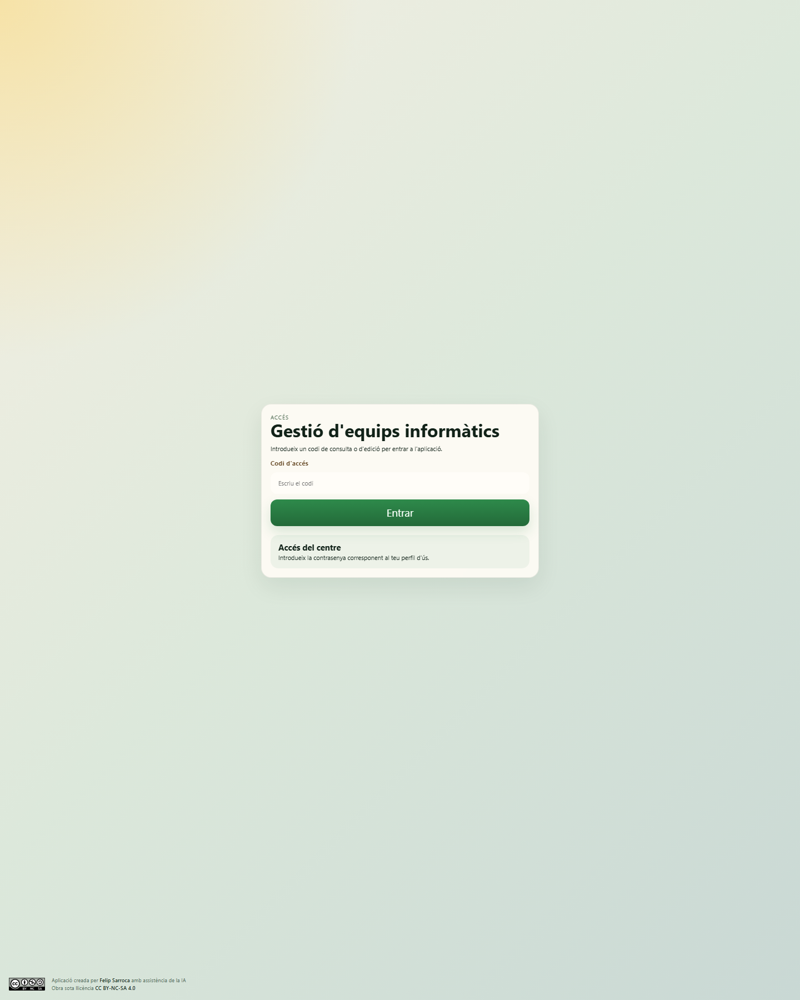
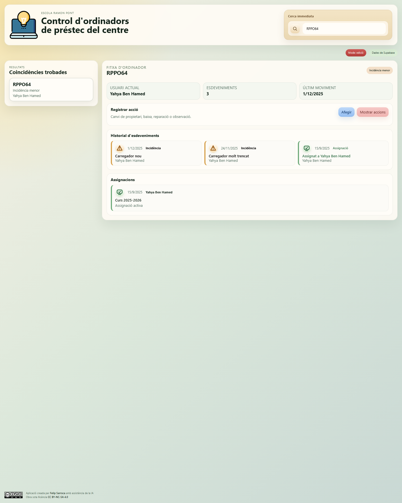
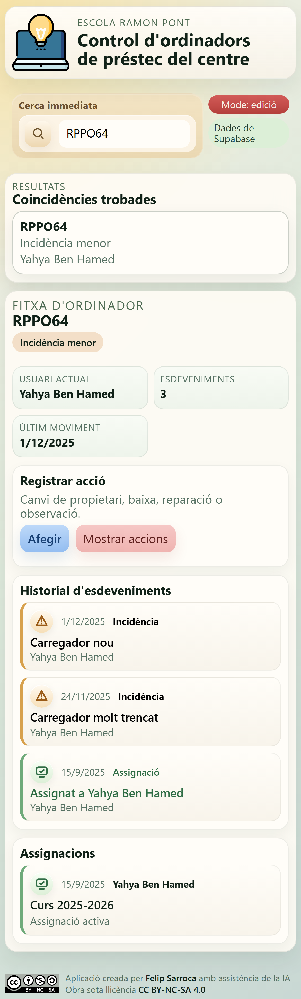

# Gestió d'equips informàtics

Aplicació web estàtica per gestionar els ordinadors de préstec del centre amb un flux ràpid de consulta, assignació, seguiment d'incidències i traçabilitat històrica.

Està pensada per funcionar bé tant des d'ordinador com des de mòbil, amb una interfície simple, accions ràpides i suport per instal·lació com a PWA.

## Captures de pantalla

### Pantalla d'accés



### Vista principal


### Fitxa d'un ordinador



### Vista mòbil



## Què resol aquesta app

L'app resol una necessitat molt concreta de centre: saber en tot moment quin ordinador està lliure, quin està assignat, a quin alumne o usuari correspon, quines incidències ha tingut i quin historial d'assignacions acumula.

La lògica de treball està basada en esdeveniments. Això permet que cada canvi quedi registrat i que es pugui reconstruir la vida completa d'un equip.

## Funcionalitats principals

- Accés per codi amb dos modes: consulta i edició.
- Cerca immediata d'ordinadors i usuaris.
- Fitxa completa d'ordinador amb estat actual, usuari actual, historial d'esdeveniments i historial d'assignacions.
- Fitxa d'usuari amb equip actual i recorregut d'ús.
- Accions ràpides per registrar canvis sense navegar per pantalles complexes.
- Edició d'esdeveniments ja registrats.
- Alta de nous ordinadors i nous usuaris des de la pròpia interfície.
- Connexió amb Supabase per treballar amb dades reals.
- Mode local de reserva si Supabase no respon.
- Preparació PWA: manifest, service worker i instal·lació en dispositius mòbils.

## Accions ràpides disponibles

Des de la fitxa d'un ordinador es poden registrar aquestes accions:

- Assignar
- Canvi de propietari
- Deixar lliure
- Incidència
- Reparació menor
- Reparació major
- Baixa
- Marcar com reparat
- Observació

Cada acció genera un esdeveniment i, quan toca, també actualitza l'estat de l'ordinador i la taula d'assignacions.

## Estats dels ordinadors

L'aplicació treballa amb aquests estats:

- `lliure`
- `assignat`
- `incidencia_menor`
- `pendent_reparacio_interna`
- `pendent_servei_tecnic_extern`
- `fora_servei`

## Modes d'accés

Actualment l'app usa Supabase Auth. Els permisos reals es defineixen amb RLS a Supabase.

| Mode | Rol a Supabase | Què permet |
| --- | --- | --- |
| Consulta | `consulta` | Veure fitxes, resultats i historial |
| Edició | `edicio` | Consultar, crear registres i editar dades |

Consulta [`seguretat-supabase.md`](./seguretat-supabase.md) i [`supabase-rls.sql`](./supabase-rls.sql) per configurar els usuaris i les polítiques de seguretat.

## Funcionament general

### 1. Entrada a l'app

L'usuari introdueix un codi d'accés i entra en mode consulta o edició.

### 2. Cerca

La capçalera incorpora una cerca immediata que filtra:

- codis RPPO
- nom i cognoms de l'usuari actual
- observacions de l'equip
- usuaris pel seu nom

### 3. Selecció d'un resultat

Quan es tria un equip, es mostra una fitxa amb:

- estat actual
- usuari actual
- nombre d'esdeveniments
- data de l'últim moviment
- historial cronològic
- historial d'assignacions

Quan es tria un usuari, es mostra:

- ordinador actual
- historial d'ordinadors
- esdeveniments associats

### 4. Registre d'accions

En mode edició es poden obrir formularis molt curts amb:

- data
- usuari, si l'acció ho necessita
- descripció

Després de desar, l'app intenta escriure a Supabase i recarrega les dades.

## Arquitectura del projecte

És una app sense procés de compilació. Tot el projecte està format per HTML, CSS i JavaScript modular.

### Peces principals

- [`index.html`](./index.html): shell principal de l'aplicació.
- [`app.js`](./app.js): lògica de la interfície, renderitzat, cerca, formularis i persistència.
- [`data.js`](./data.js): estats, accions ràpides i dades inicials de reserva.
- [`styles.css`](./styles.css): estils responsive.
- [`supabase.js`](./supabase.js): client de Supabase.
- [`supabase-config.js`](./supabase-config.js): URL i clau pública del projecte Supabase.
- [`supabase/functions/manage-users`](./supabase/functions/manage-users/index.ts): funció segura per administrar accessos amb Supabase Auth.
- [`manifest.webmanifest`](./manifest.webmanifest): configuració PWA.
- [`sw.js`](./sw.js): cache offline bàsic.
- [`instruccions.md`](./instruccions.md): document funcional del projecte.

## Model de dades

L'app treballa amb quatre entitats principals.

### Usuaris

Taula: `usuaris`

Camps rellevants:

- `id`
- `nom`
- `cognoms`
- `nom_complet`
- `tipus_usuari`
- `actiu`

### Ordinadors

Taula: `ordinadors`

Camps rellevants:

- `id`
- `codi_rppo`
- `estat_actual`
- `usuari_actual_id`
- `observacions_generals`

### Assignacions

Taula: `assignacions`

Camps rellevants:

- `id`
- `ordinador_id`
- `usuari_id`
- `data_inici`
- `data_final`
- `curs_academic`
- `motiu`

### Esdeveniments

Taula: `esdeveniments`

Camps rellevants:

- `id`
- `ordinador_id`
- `usuari_id`
- `tipus`
- `data_event`
- `descripcio`
- `estat_resultant`
- `curs_academic`

## Connexió amb Supabase

L'app intenta carregar primer les dades reals des de Supabase. Si la lectura falla, passa automàticament al mode local amb les dades del fitxer [`data.js`](./data.js).

Indicadors visibles a la interfície:

- `Dades de Supabase`
- `Mode local: no s'ha pogut llegir Supabase`
- `Desant a Supabase...`
- `Canvis desats a Supabase`

### Preparació recomanada

1. Crea un projecte a Supabase.
2. Crea a Supabase les taules `usuaris`, `ordinadors`, `assignacions` i `esdeveniments` amb els camps que es descriuen en aquest document.
3. Si vols dades inicials, carrega-les directament des del panell de Supabase o amb el procediment que facis servir al teu projecte.
4. Revisa [`supabase-config.js`](./supabase-config.js) i substitueix la URL i la clau pública per les del teu projecte.
5. Configura polítiques RLS si l'app ha de tenir un ús real fora d'un entorn de prova.

### Consideracions importants

- La clau usada al frontend ha de ser la pública (`publishable` o `anon`), no una clau de servei.
- Sense polítiques RLS adequades, qualsevol usuari amb la clau pública podria intentar llegir o escriure dades.
- L'app està preparada per a una fase inicial funcional, però encara no implementa autenticació real ni permisos fins.

## Execució en local

Com que la càrrega de mòduls ES i del `service worker` pot donar problemes amb `file://`, convé servir el projecte amb un servidor local simple.

### Opció 1. Python

```bash
python -m http.server 4173
```

Després obre:

```text
http://localhost:4173
```

### Opció 2. VS Code Live Server

També es pot obrir amb Live Server o qualsevol servidor estàtic equivalent.

## Publicació a GitHub Pages

És un projecte molt adequat per publicar a GitHub Pages perquè no necessita build.

Passos generals:

1. Puja el repositori a GitHub.
2. Activa GitHub Pages des de la branca principal o des de la carpeta que correspongui.
3. Verifica que els fitxers `index.html`, `app.js`, `styles.css` i la resta d'actius quedin publicats a l'arrel del lloc.
4. Comprova la connexió amb Supabase des del domini final i actualitza les polítiques de seguretat si cal.

## Comportaments rellevants de l'app

### Curs acadèmic automàtic

Quan es registra una acció o s'edita un esdeveniment, l'app calcula el curs acadèmic a partir de la data:

- d'agost en endavant: curs nou
- abans d'agost: curs anterior

Exemple:

- `2026-04-07` es guarda com a `2025-2026`
- `2026-09-10` es guarda com a `2026-2027`

### Tancament i obertura d'assignacions

Quan es produeix:

- una assignació nova
- un canvi de propietari
- un retorn
- una baixa
- una reparació que deixa l'equip lliure

l'app actualitza també la taula `assignacions` per mantenir un historial més consultable.

### Edició d'esdeveniments

Els esdeveniments de la cronologia es poden obrir i editar en mode edició. Això permet corregir:

- la data
- l'usuari associat
- la descripció

## PWA i ús en mòbil

El projecte ja inclou els elements bàsics d'una Progressive Web App:

- `manifest.webmanifest`
- `service worker`
- icones
- diàleg d'instal·lació en mòbil

Això permet:

- obrir l'app com si fos nativa
- fixar-la a la pantalla d'inici
- conservar part del shell en memòria cau

## Limitacions actuals

Aquest projecte ja és funcional, però encara té límits clars:

- cal crear usuaris reals a Supabase Auth
- cal executar les polítiques RLS abans d'usar dades sensibles
- no hi ha filtres avançats per curs, estat o període
- no hi ha exportació d'informes
- el `service worker` fa cache bàsica i no una estratègia offline avançada

## Millores recomanades

- Migrar l'accés a Supabase Auth.
- Afegir RLS complet per lectura i escriptura.
- Incorporar filtres per curs acadèmic, estat i tipus d'incidència.
- Afegir informes i exportació a CSV.
- Separar millor la capa de dades de la capa de presentació.
- Externalitzar la configuració sensible fora del repositori públic.
- Crear proves funcionals bàsiques dels fluxos principals.

## Estructura del repositori

```text
Gestio-Equips/
├─ app.js
├─ data.js
├─ index.html
├─ styles.css
├─ supabase.js
├─ supabase-config.js
├─ manifest.webmanifest
├─ sw.js
├─ instruccions.md
├─ favicon.svg
├─ favicon.png
├─ CC_BY-NC-SA.svg
└─ assets/
   └─ screenshots/
      ├─ 01-acces-desktop.png
      ├─ 02-vista-principal-desktop.png
      ├─ 03-fitxa-ordinador-desktop.png
      └─ 04-fitxa-ordinador-mobile.png
```

## Autoria i llicència

Segons el peu de l'aplicació, el projecte està identificat com una obra de Felip Sarroca amb assistència de la IA i sota llicència CC BY-NC-SA 4.0.

Si vols reforçar això a nivell de repositori, convé afegir també un fitxer `LICENSE` explícit amb el text o l'enllaç oficial corresponent.
