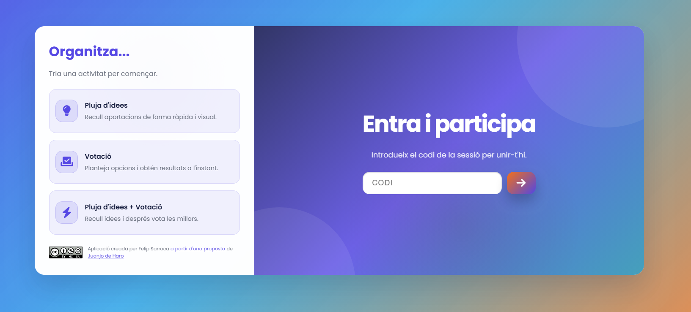

# Participem



## Descripció

Participem és una aplicació web multirole pensada per dinamitzar activitats col·laboratives tant a l'aula presencial com en entorns híbrids. Permet que l'organitzador llanci una pluja d'idees, reculli i moderi aportacions en directe, i activi una votació final per prioritzar-les.

## Funcionalitats clau

- **Modes d'activitat flexibles**: pluja d'idees, votació o itinerari combinat (idees + votació).
- **Codi de sessió**: accés ràpid perquè els participants s'uneixin des de qualsevol dispositiu.
- **Edició d'idees**: l'organitzador pot esborrar propostes amb la paperera contextual.
- **Resultats en temps real**: visualitzacions adaptatives que mostren estat i recompte de vots.
- **Interfície tàctil-friendly**: tots els controls responen a clic i a toc.
- **Persistència local**: recupera idees i vots si hi ha recàrregues involuntàries.

## Flux de treball

1. A `index.html`, el docent tria el tipus d'activitat.
2. A `config.html`, configura la pregunta, els límits d'idees o vots i, si cal, les opcions de la votació.
3. Es genera un codi curt i s'obre `activity.html` en mode organitzador.
4. Els participants accedeixen a `activity.html?session=CODI&mode=guest` i envien idees o voten.
5. Quan la fase d'ideació acaba, l'organitzador inicia la votació, visualitza els resultats i pot tancar la sessió.

## Requisits tècnics

- Navegador modern compatible amb ECMAScript 2020 i WebRTC (necessari per PeerJS).
- Connexió a Internet estable per utilitzar el servidor públic de PeerJS.
- Entorn d'allotjament estàtic (GitHub Pages, Netlify, Vercel, etc.) amb HTTPS.

## Estructura del projecte

```
Participem/
├── index.html      # Pantalla inicial: accés docent/participant
├── config.html     # Formulari de configuració de l'activitat
├── activity.html   # Sala en directe per a organitzador i convidats
├── script.js       # Lògica de navegació inicial
├── config.js       # Generació de codis i tractament del formulari
├── activity.js     # Estat global, PeerJS i renderització dinàmica
├── style.css       # Estils de la portada
├── config.css      # Estils de la configuració
├── activity.css    # Estils de l'activitat en directe
├── Captura.PNG     # Captura utilitzada en aquest README
└── altres recursos (favicon, llicència CC, instruccions...)
```

## Guia ràpida de desplegament

1. Puja la carpeta `Participem` a un servei d'allotjament estàtic amb HTTPS.
2. Verifica que els navegadors poden carregar `index.html` sense bloquejos de seguretat.
3. Comparteix l'URL principal amb el professorat i facilita el codi de sessió a l'alumnat.
4. Abans d'una sessió real, prova la connexió amb dos dispositius per assegurar el flux PeerJS.

## Bones pràctiques

- Mantén la longitud dels codis de sessió prou alta per evitar col·lisions al servidor PeerJS.
- Si la xarxa del centre és restringida, demana que s'autoritzi el trànsit WebRTC/PeerJS.
- Desa còpies de seguretat abans de personalitzar estils o lògica.

## Crèdits

Aplicació creada per Felip Sarroca a partir d'una proposta de Juanjo de Haro. Consulta `Instruccions.txt` per trobar una guia detallada d'ús i la llicència Creative Commons corresponent.
