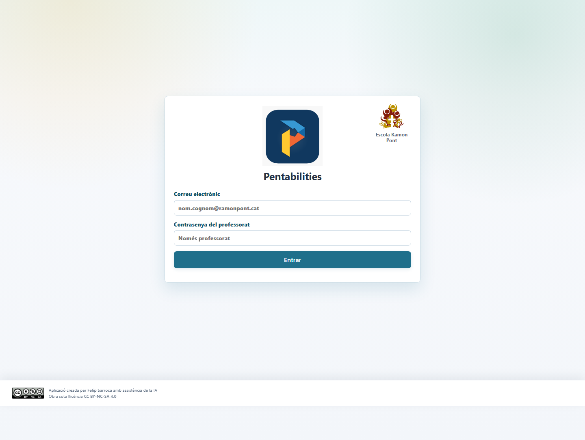
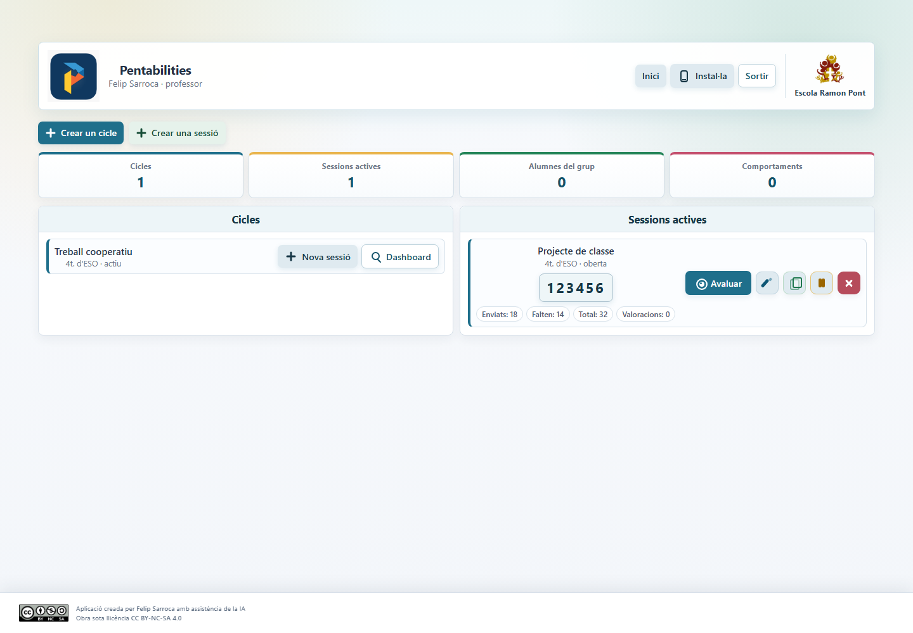
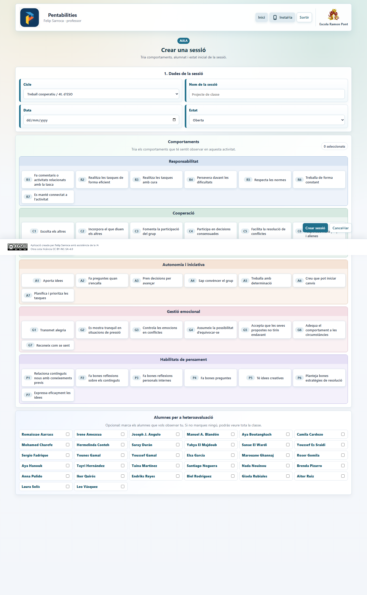
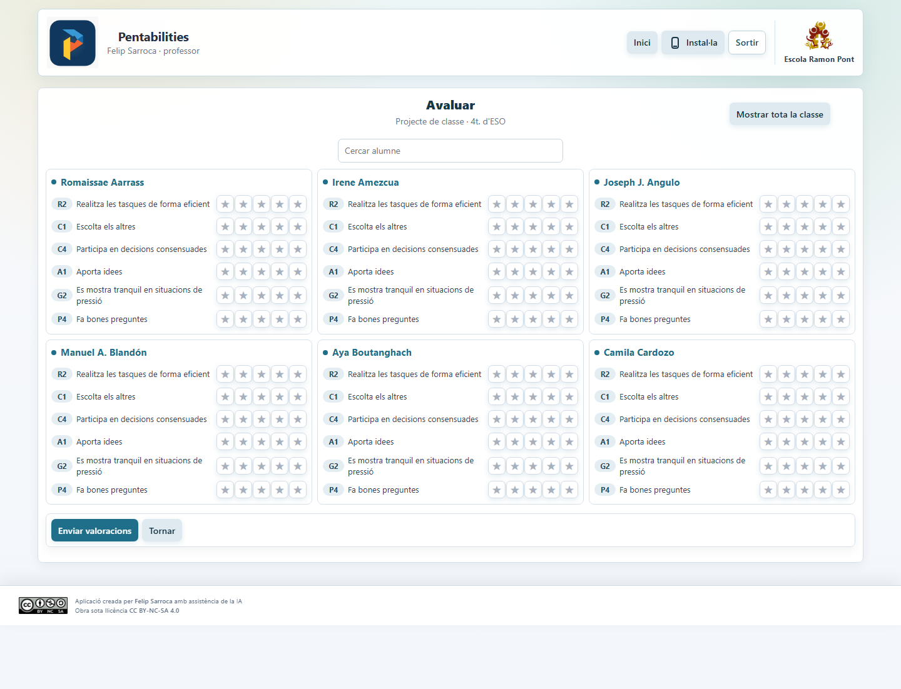

# Pentabilities

Aplicació web per gestionar cicles, sessions i valoracions Pentabilities a l'Escola Ramon Pont.

Pentabilities permet al professorat crear sessions d'observació, seleccionar comportaments, recollir valoracions de l'alumnat i fer el seguiment dels resultats de manera ordenada. L'app està pensada per funcionar com a aplicació web estàtica publicada amb GitHub Pages, amb suport de Google Apps Script i Supabase per a la persistència i la sincronització de dades.

## URL pública

L'aplicació està preparada per funcionar a:

```text
https://felipsarroca.github.io/util-apps/Pentabilities/
```

La carpeta del projecte es diu `Pentabilities` amb la `P` majúscula. GitHub Pages diferencia majúscules i minúscules, per tant la URL correcta també ha de fer servir `Pentabilities`.

## Captures de pantalla

Les captures següents són imatges reals de l'app executada localment en mode de previsualització amb dades de mostra.

### Pantalla d'entrada



### Inici del professorat



### Creació d'una sessió



### Avaluació de l'alumnat



## Objectiu de l'aplicació

L'app vol facilitar una observació sistemàtica i pràctica dels comportaments vinculats a les Pentabilities. El professorat pot preparar una sessió, triar els comportaments que vol observar i recollir valoracions de manera àgil, tant des de l'aula com des d'un dispositiu mòbil.

Els objectius principals són:

- Centralitzar els cicles, sessions, alumnes i valoracions en una mateixa eina.
- Reduir la gestió manual de codis, formularis i fulls de càlcul.
- Facilitar l'autoavaluació, la coavaluació i l'heteroavaluació.
- Donar al professorat una visió resumida de les sessions actives i dels comportaments avaluats.
- Mantenir una estructura prou simple per publicar-la i mantenir-la des de GitHub Pages.

## Funcionalitats principals

- Accés amb Google limitat als comptes vinculats a usuaris autoritzats.
- Creació i gestió de cicles d'avaluació.
- Creació de sessions associades a un cicle i a un grup classe.
- Selecció dels comportaments que s'observaran en cada sessió.
- Assignació d'alumnes per a l'heteroavaluació.
- Generació d'un codi de sessió per a l'alumnat.
- Pantalla d'avaluació amb estrelles per valorar cada comportament.
- Resum de cicles, sessions actives, alumnat avaluat i comportaments treballats.
- Integració amb Apps Script per comunicar-se amb Google Sheets.
- Integració amb Supabase per reforçar el model de dades, les consultes i les estadístiques.
- Comportament adaptable a ordinador i mòbil.
- Instal·lació com a PWA des de navegadors compatibles.

## Flux d'ús

1. L'usuari entra amb el compte de Google vinculat al seu usuari intern.
2. Crea un cicle o selecciona un cicle ja existent.
3. Crea una sessió vinculada al cicle.
4. Tria els comportaments Pentabilities que vol observar.
5. Selecciona, si cal, l'alumnat que vol observar directament.
6. Comparteix o projecta el codi de sessió.
7. L'alumnat entra a la sessió i envia les seves valoracions.
8. El professor pot fer l'avaluació dels alumnes.
9. L'app actualitza els recomptes i els resultats disponibles.

## Perfils d'usuari

### Professorat

Pot crear cicles i sessions, obrir o bloquejar sessions, revisar dades agregades, avaluar alumnes i gestionar el funcionament de l'activitat.

### Alumnat

Pot accedir a una sessió mitjançant un codi i fer les valoracions que corresponguin segons la configuració de la sessió.

## Arquitectura tècnica

Pentabilities combina una aplicació frontend estàtica amb serveis externs per a dades i automatització.

```text
GitHub Pages
  index.html
  styles.css
  app.js
  assets/
        |
        v
Google Apps Script <-> Google Sheets
        |
        v
Supabase
```

### Frontend

El frontend és una aplicació web estàtica formada principalment per:

- `index.html`: punt d'entrada de l'app.
- `styles.css`: estils generals, disseny responsive i adaptacions mòbils.
- `app.js`: lògica principal de la interfície, navegació, estat de l'app i comunicació amb els serveis.
- `config.js`: configuració activa de l'entorn.
- `config.example.js`: plantilla segura de configuració.
- `manifest.webmanifest`: configuració PWA.
- `service-worker.js`: suport de memòria cau i instal·lació.

### Google Apps Script

La carpeta `apps-script/` conté la integració amb Google Sheets i una implementació anterior de la interfície. L'aplicació canònica publicada a GitHub Pages autentica els usuaris mitjançant Supabase Auth.

### Supabase

La carpeta `supabase/` conté la configuració i les migracions SQL del projecte Supabase. Supabase és el backend de dades i d'autenticació de l'aplicació canònica. Google autentica la identitat i la taula `app_user_identities` decideix quin usuari intern li correspon.

## Estructura del projecte

```text
Pentabilities/
  index.html
  styles.css
  app.js
  config.js
  config.example.js
  manifest.webmanifest
  service-worker.js
  README.md
  assets/
    cc-by-nc-sa.png
    pentabilities.png
    pentabilities-logo.png
    pwa-icon-192.png
    pwa-icon-512.png
    ramon-pont.png
  apps-script/
    Api.gs
    Auth.gs
    Code.gs
    Config.gs
    CyclesService.gs
    DashboardService.gs
    EvaluationsService.gs
    RosterService.gs
    SeedData.gs
    SessionsService.gs
    SheetsService.gs
    SupabaseSync.gs
    UsersService.gs
    appsscript.json
    README.md
  docs/
    apps-script/
      AUDIT_2026-07-02.md
      DATA_MODEL.md
      DEPLOYMENT.md
      GUIA_PROFESSORAT.md
      SECURITY.md
      TEST_PLAN.md
    reference/
      descripcio-funcionament-proces.pdf
      habilitats-comportaments-pentabilities.pdf
    screenshots/
      01-registre.png
      02-inici-professor.png
      03-nova-sessio.png
      04-avaluacio.png
  supabase/
    config.toml
    migrations/
      20260702063025_pentabilities_schema.sql
      20260702194322_pentabilities_supabase_app_hardening.sql
      20260704101302_add_teacher_home_stats.sql
```

## Configuració del frontend

El fitxer `config.js` és el punt on es defineixen les connexions reals de l'app. No ha de contenir secrets privats.

El fitxer `config.example.js` serveix com a plantilla. En una instal·lació nova, cal copiar-lo o adaptar-lo:

```text
config.example.js -> config.js
```

El frontend pot necessitar valors com:

- URL pública del desplegament de Google Apps Script.
- URL del projecte Supabase.
- Clau pública anònima de Supabase.
- Domini de Google suggerit a la pantalla de selecció de compte.

La clau pública de Supabase del frontend pot ser visible al navegador, però ha d'estar protegida amb polítiques RLS, permisos correctes i funcions controlades a la base de dades. No s'ha de posar mai una clau `service_role` dins del frontend.

## Desenvolupament local

Com que l'app és estàtica, es pot provar amb un servidor local senzill des de l'arrel del repositori `util-apps`:

```powershell
python -m http.server 8000
```

Després es pot obrir:

```text
http://127.0.0.1:8000/Pentabilities/
```

És recomanable provar-la amb servidor local i no obrint directament `index.html`, perquè alguns navegadors apliquen restriccions diferents quan els fitxers es carreguen amb `file://`.

## Publicació amb GitHub Pages

Aquest projecte està pensat per publicar-se com una subcarpeta del repositori `util-apps`.

Passos generals:

1. Obrir el repositori `util-apps` amb GitHub Desktop.
2. Revisar que els canvis afectin només els fitxers previstos.
3. Fer un commit amb un missatge clar, per exemple:

```text
Actualitza documentació de Pentabilities
```

4. Fer `Push origin`.
5. Esperar que GitHub Pages actualitzi la publicació.
6. Obrir:

```text
https://felipsarroca.github.io/util-apps/Pentabilities/
```

Si apareix un error 404, cal comprovar especialment:

- Que la carpeta es digui exactament `Pentabilities`.
- Que `index.html` sigui dins de `Pentabilities/`.
- Que GitHub Pages estigui activat al repositori `util-apps`.
- Que la branca publicada sigui la correcta.
- Que no s'estigui obrint la ruta amb `pentabilities` en minúscula.

## Gestió d'Apps Script amb clasp

El codi de Google Apps Script es manté localment dins `apps-script/`. La sincronització amb el projecte real s'ha de fer amb `clasp`.

Ordres habituals:

```powershell
cd Pentabilities/apps-script
clasp status
clasp push
```

El fitxer `.clasp.json` no s'ha de publicar si conté identificadors locals o informació sensible del projecte. Ha de quedar ignorat per Git.

Documentació relacionada:

- `docs/apps-script/DEPLOYMENT.md`
- `docs/apps-script/DATA_MODEL.md`
- `docs/apps-script/SECURITY.md`
- `docs/apps-script/TEST_PLAN.md`
- `apps-script/README.md`

## Gestió de Supabase

Les migracions de Supabase es troben a:

```text
supabase/migrations/
```

Les migracions permeten tenir controlada l'evolució de la base de dades. Abans d'aplicar canvis en producció, cal revisar que el projecte Supabase vinculat sigui el correcte.

Ordres habituals:

```powershell
cd Pentabilities
supabase status
supabase link --project-ref <project-ref>
supabase db push
```

En aquest projecte és especialment important comprovar el compte i el projecte de Supabase abans d'aplicar migracions, perquè pot haver-hi més d'un compte o projecte disponible.

La configuració completa de Google OAuth, el hook d'autorització i l'ordre de desplegament es documenten a `docs/SUPABASE_GOOGLE_AUTH.md`.

## Seguretat

Criteris bàsics de seguretat del projecte:

- No publicar contrasenyes, tokens privats ni claus `service_role`.
- No incloure secrets dins `app.js`, `index.html` o `config.js`.
- Fer servir només claus públiques al frontend.
- Protegir les dades de Supabase amb RLS, permisos i funcions controlades.
- Mantenir `.clasp.json`, `.env`, carpetes temporals i fitxers locals fora de Git.
- Evitar exposar dades personals reals en captures, exemples o documentació pública.
- Revisar les migracions SQL abans d'aplicar-les al projecte remot.

## PWA

L'app inclou fitxers per funcionar com a Progressive Web App:

- `manifest.webmanifest`
- `service-worker.js`
- `assets/pwa-icon-192.png`
- `assets/pwa-icon-512.png`

Això permet que els navegadors compatibles ofereixin l'opció d'instal·lar l'app al dispositiu. La instal·lació pot variar segons el navegador i el sistema operatiu.

## Dades i privacitat

L'aplicació pot gestionar informació vinculada a alumnat, professorat, sessions i valoracions. Per aquest motiu:

- No s'han de publicar exportacions amb dades reals.
- Les captures de pantalla públiques han d'evitar dades sensibles.
- Les credencials del professorat no s'han d'incloure en documentació pública.
- Les proves amb dades de mostra són preferibles per a documentació i desenvolupament.

## Verificació abans de publicar

Abans de pujar canvis a GitHub, és recomanable comprovar:

- L'app carrega correctament a `http://127.0.0.1:8000/Pentabilities/`.
- La pantalla d'entrada amb Google es mostra bé.
- Un compte vinculat pot entrar i recupera el seu usuari intern correcte.
- Un compte del mateix domini però no vinculat no pot entrar.
- La sessió es restaura després de tancar i tornar a obrir el navegador.
- L'opció «Sortir» elimina la sessió.
- Es poden veure els cicles i les sessions actives.
- Es pot crear una sessió.
- Es pot obrir la pantalla d'avaluació.
- La versió mòbil manté una capçalera i un peu de pàgina correctes.
- No hi ha fitxers temporals afegits per error al control de versions.
- No hi ha secrets dins dels fitxers que es pujaran a GitHub.

## Documentació complementària

La carpeta `docs/` conté documentació tècnica i materials de referència:

- `docs/apps-script/`: desplegament, model de dades, seguretat, pla de proves i guia del professorat.
- `docs/reference/`: documents de referència del procés i dels comportaments Pentabilities.
- `docs/screenshots/`: captures de pantalla reals utilitzades en aquest README.

## Llicència i autoria

Aplicació creada per Felip Sarroca amb assistència de la IA.

Obra sota llicència Creative Commons BY-NC-SA 4.0.

La llicència permet compartir i adaptar el material amb atribució, sense ús comercial i mantenint la mateixa llicència en les obres derivades.
