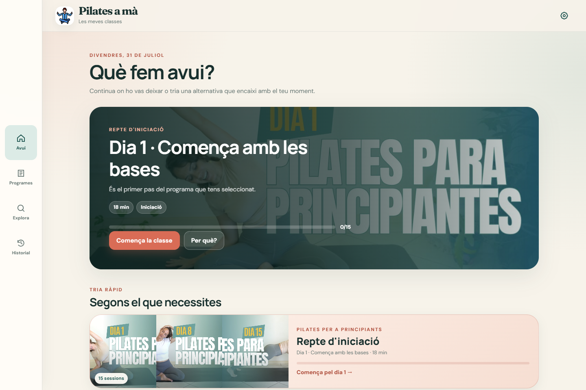
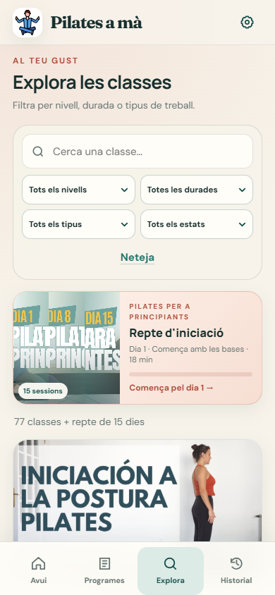

# Pilates a mà

Una aplicació web instal·lable per trobar, seguir i reprendre classes de Pilates del canal de [María Plaza Carrasco](https://www.youtube.com/c/Mar%C3%ADaPlazaCarrasco/videos), sense comptes ni dades al núvol.

[Obre l'aplicació](https://ja.cat/pilates) · [Accés directe a GitHub Pages](https://felipsarroca.github.io/util-apps/Pilates/)



## Què hi pots fer

- Rebre una proposta per a avui segons el nivell, el temps disponible i el progrés desat.
- Seguir tres itineraris ordenats: un repte d'iniciació de 15 dies, una progressió per cuidar els genolls i una progressió intermèdia.
- Explorar 92 classes amb cerca i filtres per nivell, durada, tipus de treball i estat.
- Accedir ràpidament a sessions de cos complet, nivell intermedi, menys de 30 minuts i fonaments.
- Marcar classes com a preferides, en curs o completades i reprendre-les més endavant.
- Consultar l'activitat setmanal, l'historial filtrable, les tendències i el progrés de cada programa.
- Afegir classes personals a partir d'un enllaç de YouTube.
- Exportar, combinar o restaurar una còpia de seguretat de les dades.
- Instal·lar l'app com a PWA i consultar el catàleg i l'historial sense connexió.

Els vídeos es reprodueixen des de YouTube i necessiten connexió a Internet. La selecció «Cuida els genolls» es basa en els títols publicats pel canal i no substitueix el criteri d'un professional sanitari.

## Com s'utilitza

1. A **Avui**, obre la classe recomanada o tria un accés ràpid.
2. A **Programes**, segueix les sessions en ordre i consulta el progrés acumulat.
3. A **Explora**, combina la cerca i els filtres per trobar una classe concreta.
4. Durant una sessió, pots mantenir la pantalla encesa, obrir el vídeo a YouTube i marcar la classe com a feta.
5. A **Historial**, revisa la regularitat, continua sessions pendents o desfés una finalització.

La configuració permet ajustar el nivell i la durada habituals, prioritzar la selecció per als genolls, gestionar classes personals i fer còpies de seguretat.

## Captures de pantalla

La portada anterior i la vista mòbil següent s'han generat amb Chrome a partir de l'aplicació real, en un perfil net i sense dades personals.

### Explora · mòbil

<p align="center">
  
</p>

## Privacitat i funcionament fora de línia

L'historial, els preferits, les preferències i les classes personals es desen exclusivament al `localStorage` del navegador. L'aplicació no requereix registre i no envia aquestes dades a cap servidor propi.

El *service worker* conserva els fitxers essencials perquè la interfície, el catàleg i l'historial continuïn disponibles sense connexió. Les miniatures i la reproducció dels vídeos depenen de YouTube.

## Execució local

No hi ha cap procés de compilació. Cal servir la carpeta per HTTP perquè el *service worker* funcioni; obrir `index.html` directament no és suficient.

Amb Node.js:

```powershell
node scripts\preview-server.cjs
```

O bé amb Python:

```powershell
python -m http.server 4173 --bind 127.0.0.1
```

Després, obre `http://127.0.0.1:4173/`. Per canviar el port del servidor inclòs:

```powershell
$env:PILATES_PREVIEW_PORT = 4174
node scripts\preview-server.cjs
```

## Estructura del projecte

| Ruta | Responsabilitat |
| --- | --- |
| `index.html` | Estructura de les quatre vistes, diàlegs, reproductor i navegació. |
| `styles.css` | Sistema visual, components i adaptació a mòbil, escriptori, reflow i contrast forçat. |
| `app.js` | Estat local, recomanacions, filtres, historial, reproductor, importació i exportació. |
| `data/catalog.js` | Catàleg canònic de vídeos, programes i col·leccions. |
| `sw.js` | Memòria cau i comportament fora de línia. |
| `manifest.webmanifest` | Metadades i icones de la PWA. |
| `tests/smoke.cjs` | Prova funcional i responsive amb Playwright. |
| `scripts/preview-server.cjs` | Servidor HTTP local sense dependències. |

## Actualització del catàleg

El catàleg canònic és `data/catalog.js`:

- `videos` conté cada vídeo una sola vegada i utilitza l'identificador de YouTube.
- `programs` defineix itineraris ordenats mitjançant identificadors de vídeo.
- `collections` defineix accessos ràpids i filtres sense duplicar entrades.

Cada vídeo ha d'incloure `id`, `title`, `originalTitle`, `duration`, `level` i `tags`. En iniciar-se, l'app valida els identificadors duplicats i les referències inexistents als programes.

Quan s'afegeixin vídeos, convé mantenir els títols breus en català, conservar el títol original, expressar la durada en segons i reutilitzar les etiquetes existents sempre que sigui possible.

## Proves

La prova de fum requereix Node.js, Playwright i Google Chrome:

```powershell
node tests\smoke.cjs
```

Si el port 4173 està ocupat:

```powershell
$env:PILATES_TEST_PORT = 4174
node tests\smoke.cjs
```

La suite comprova el flux principal de navegació i sessió, els 92 vídeos, l'ordre dels programes, els preferits, l'historial, la persistència, les classes personals, les còpies de seguretat, la PWA, el mode sense connexió i diversos requisits d'accessibilitat i disseny responsive.

## Publicació

Totes les rutes són relatives, de manera que l'aplicació pot publicar-se dins la subcarpeta `Pilates/` de GitHub Pages. Després de modificar fitxers que es desen a la memòria cau, també cal actualitzar la versió de la memòria cau a `sw.js` perquè les instal·lacions existents rebin els canvis.

## Crèdits i llicència

- Classes i miniatures: [María Plaza Carrasco a YouTube](https://www.youtube.com/c/Mar%C3%ADaPlazaCarrasco/videos). Els continguts externs conserven les condicions dels seus titulars.
- Aplicació creada per [Felip Sarroca](https://ja.cat/felipsarroca) amb assistència d'IA.
- Codi i disseny de l'aplicació: [CC BY-NC-SA 4.0](https://creativecommons.org/licenses/by-nc-sa/4.0/deed.ca).
