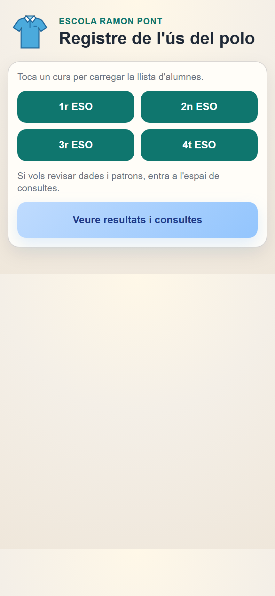
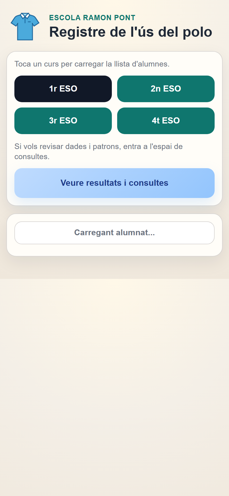
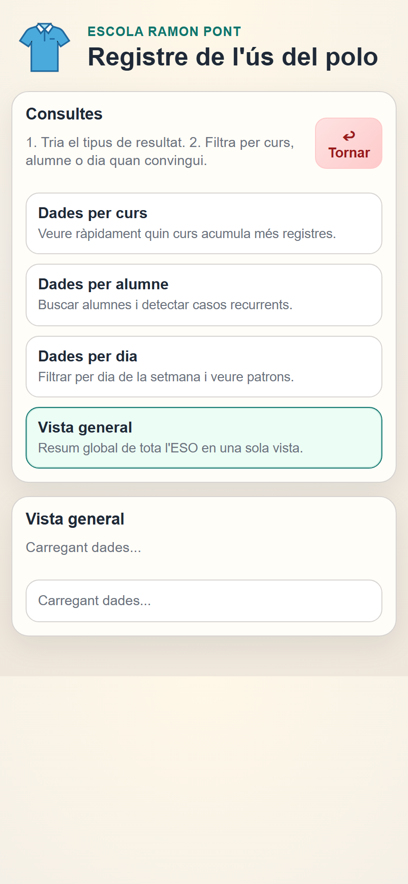
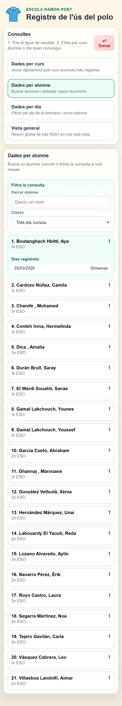

# Registre de l'ús del polo

Aplicació web pensada per registrar de manera molt ràpida quin alumnat de l'ESO no porta el polo de l'escola i consultar-ne els resultats des del mòbil o des de l'ordinador.

La versió publicada es pot obrir des de:

- `http://ja.cat/poloapp`

## Visió general

L'app està orientada a un ús quotidià, amb pocs clics i una interfície molt directa:

- selecció immediata del curs
- càrrega automàtica de l'alumnat del grup
- registre d'una incidència amb un sol toc
- bloqueig de duplicats el mateix dia
- espai de consultes amb filtres i resums
- instal·lació com a PWA a la pantalla d'inici del mòbil

## Captures de pantalla

Captures fetes a partir de la web publicada el 25 de març de 2026.

### Pantalla inicial



### Registre d'alumnat per curs



### Vista general de consultes



### Consulta per alumne



## Funcionalitats principals

### Registre ràpid

- mostra els cursos `1r ESO`, `2n ESO`, `3r ESO` i `4t ESO`
- en tocar un curs, carrega la llista d'alumnes actius d'aquell grup
- cada alumne apareix amb un botó d'acció per marcar la incidència
- si l'alumne ja ha estat registrat aquell dia, el botó queda desactivat

### Control de duplicats

- el backend genera una clau única amb format `data|id_alumne`
- si es torna a intentar registrar el mateix alumne el mateix dia, no duplica la dada
- l'app mostra l'estat com a incidència ja registrada

### Consultes i resultats

L'espai de consultes ofereix quatre tipus de resum:

- `Vista general`: resum global amb total de registres, curs amb més incidències, alumne amb més incidències i darrer dia amb registre.
- `Dades per curs`: comparativa entre cursos, amb filtre per classe.
- `Dades per alumne`: cerca per nom i filtre per curs, amb historial desplegable de dies registrats.
- `Dades per dia`: recompte per dia de la setmana per detectar patrons.

### Instal·lació com a app

- a Android, l'app pot mostrar el missatge d'instal·lació del navegador
- a iPhone i iPad, es mostra una guia per afegir-la a la pantalla d'inici des de Safari
- incorpora `manifest.webmanifest` i `service-worker.js`

## Flux d'ús

1. Obre la web.
2. Toca el curs.
3. Espera que es carregui la llista d'alumnes.
4. Marca l'alumne que no porta el polo.
5. Consulta els resultats des del botó `Veure resultats i consultes`.

## Com funciona internament

### Frontend

El frontend és una app estàtica feta amb HTML, CSS i JavaScript vanilla.

Responsabilitats principals:

- renderitzar la selecció de cursos
- carregar l'alumnat des del backend
- registrar incidències
- mostrar missatges d'estat
- presentar els informes i filtres
- gestionar la instal·lació PWA
- registrar el service worker

Fitxers principals:

- `index.html`: estructura de la interfície
- `css/styles.css`: estils visuals i disseny mobile-first
- `js/app.js`: lògica d'interacció, consultes i renderitzat
- `manifest.webmanifest`: configuració PWA
- `service-worker.js`: memòria cau bàsica per a l'app shell

### Backend

El backend està fet amb Google Apps Script i s'exposa com a web app.

La URL configurada al frontend és:

- `https://script.google.com/macros/s/AKfycbx38uh7P5qqE6HgRWGNKI29KeZbGRCMlO2zz4Eu3VRi246c3nutH_M01ZxKDWvy41o/exec`

Accions disponibles:

- `getStudents`
- `registerStudent`
- `getOverviewSummary`
- `getCourseSummary`
- `getStudentSummary`
- `getWeekdaySummary`

## Estructura del Google Sheets

L'script treballa sobre un full de càlcul amb dues pestanyes obligatòries:

### Pestanya `Alumnat`

Capçaleres esperades:

- `id_alumne`
- `nom_complet`
- `curs`
- `actiu`

Notes:

- només es carreguen alumnes amb dades completes
- el camp `actiu` permet filtrar alumnat no actiu
- els cursos admesos són `1r ESO`, `2n ESO`, `3r ESO` i `4t ESO`

### Pestanya `Registres`

Capçaleres esperades:

- `id_registre`
- `timestamp`
- `data`
- `hora`
- `any`
- `mes`
- `trimestre`
- `dia_setmana_num`
- `dia_setmana_text`
- `id_alumne`
- `nom_complet`
- `curs`
- `clau_unica`

Cada registre desa informació suficient per poder explotar les dades després sense càlculs manuals.

## Resums que genera el backend

### Vista general

- total de registres acumulats
- curs amb més incidències
- alumne amb més incidències
- darrer dia amb registre

### Dades per curs

- total de registres per curs
- nombre d'alumnes afectats per curs
- nombre total d'alumnes per curs
- mitjana d'incidències per alumne

### Dades per alumne

- total d'incidències per alumne
- curs de l'alumne
- darrera data registrada
- historial complet de dies

Nota: actualment el resum per alumne retorna els 50 alumnes amb més registres.

### Dades per dia

- recompte d'incidències de dilluns a divendres
- dia amb més registres

## Estructura del projecte

```text
Polo-App/
|-- assets/
|   |-- favicon.svg
|   |-- icon-192.png
|   |-- icon-512.png
|   |-- readme-inici.png
|   |-- readme-registre.png
|   |-- readme-consultes-general.png
|   `-- readme-consultes-alumne.png
|-- css/
|   `-- styles.css
|-- js/
|   `-- app.js
|-- Code.gs
|-- index.html
|-- manifest.webmanifest
|-- service-worker.js
`-- README.md
```

## Desplegament recomanat

### Frontend

La manera més pràctica és publicar-lo amb GitHub Pages o qualsevol hosting estàtic amb `https`.

Requisits:

- servir `index.html`
- servir `manifest.webmanifest`
- servir `service-worker.js`
- tenir la web sota `https`

### Backend

1. Crea o reutilitza un Google Sheets.
2. Afegeix les pestanyes `Alumnat` i `Registres`.
3. Copia-hi l'script `Code.gs`.
4. Publica'l com a web app.
5. Substitueix `API_BASE_URL` dins `js/app.js` per la URL del teu desplegament.

## Com provar-la

### Prova funcional bàsica

1. Obre l'app.
2. Entra en un curs.
3. Comprova que es carrega l'alumnat.
4. Marca un alumne.
5. Reintenta marcar-lo el mateix dia i comprova que no duplica.
6. Entra a `Consultes` i revisa que els resums s'actualitzen.

### Prova com a PWA

1. Obre la web amb `https`.
2. Espera que es registri el service worker.
3. Afegeix-la a la pantalla d'inici.
4. Obre-la com a app independent.

## Limitacions actuals

- l'app està pensada per a quatre cursos d'ESO fixos
- no incorpora autenticació ni control d'usuaris
- no permet editar o esborrar registres des de la interfície
- el resum per alumne es limita als 50 casos amb més incidències
- el resum per dia està enfocat a dies lectius de dilluns a divendres

## Millores futures possibles

- filtres per trimestre, mes o franja temporal
- exportació de resultats
- gràfics visuals per a equips docents
- panell d'administració per gestionar alumnat
- historial de canvis o anul·lació de registres
- autenticació per professorat

## Llicència i ús

Aquest repositori no indica encara una llicència específica. Si vols compartir-lo o reutilitzar-lo públicament, convé afegir-hi una llicència explícita.
